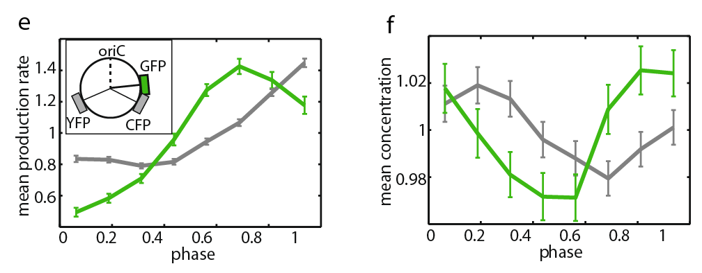

## Fluo in lactose

Plot an example of GFP traces:

```{r}
filter(myframes, date=='20150624', pos==0, gl==4) %>% 
  filter(!discard_top, !discard_start, b_rank<4) %>% 
  mutate(time_sec=time_sec-2*3600) %>% 
  plot_faceted_var_tracks(.var_col='gfp_nb', .col='darkgreen') +
  scale_x_hours(4) +
  scale_y_continuous(breaks=c(0, 5000, 10000)) +
  expand_limits(y=0) +
  labs(y='total GFP per cell (molecules)') +
  theme(strip.background = element_blank(), strip.text = element_blank())
# ggsave('plots/asc_lac_gfp_time.pdf', width=4, height=3.5)

filter(myframes, date=='20150624', pos==0, gl==4) %>% 
  filter(!discard_top, !discard_start, b_rank<4) %>% 
  mutate(time_sec=time_sec-2*3600) %>% 
  plot_faceted_var_tracks(.var_col='gfp_nb', .log=TRUE, .col='darkgreen') +
  scale_x_hours(4) +
  scale_y_continuous(trans='log', breaks=c(3000, 6000, 12000)) +
  labs(y='total GFP per cell (molecules)') +
  theme(strip.background = element_blank(), strip.text = element_blank())
# ggsave('plots/asc_lac_loggfp_time.pdf', width=8, height=5)

filter(myframes, date=='20150624', pos==0, gl==4) %>% 
  filter(!discard_top, !discard_start, b_rank<4) %>% 
  mutate(time_sec=time_sec-2*3600) %>% 
  plot_faceted_var_tracks(.var_col='length_um', .log=TRUE, .col='gray15') +
  scale_x_hours(4) +
  scale_y_continuous(trans='log2') +
  labs(y='cell length (µm)') +
  theme(strip.background = element_blank(), strip.text = element_blank())
# ggsave('plots/asc_lac_length_time.pdf', width=4, height=3.5)

```

In this case, r2 CDFs don't help concluding whether the GFP increase over the cell cycle is more exponential (null model assuming concentration homeostasis) or linear:

```{r}
ggplot(mycells %>% filter(condition %in% 'lactose') ) +
  stat_ecdf(aes(logg_time_r2, col='GFP', lty='exponential')) +
  stat_ecdf(aes(g_time_r2, col='GFP', lty='linear')) +
  stat_ecdf(aes(logl_time_r2, col='length', lty='exponential')) +
  stat_ecdf(aes(l_time_r2, col='length', lty='linear')) +
  labs(x='Pearson correlation r2', y='cumulative probability', lty='fit', col='variable') +
  xlim(0.74, 1) +
  theme(legend.justification=c(0, 1), legend.position=c(0, 1))
# ggsave('plots/asc_gfp_time_r2ecdf.pdf', width=2.5, height=3.5)

```


```{r eval=FALSE}
ggplot(mycells %>% filter(condition %in% 'lactose'),
       aes(l_time_r2, logl_time_r2) ) +
  geom_point(size=.5, alpha=.5) +
  geom_abline(col='red') +
  xlim(0.94, 1) + ylim(0.94, 1)

```

Surprisingly, most cells are described as accurately by a linear or an exponential fit (with r2>0.97). For cells which cannot be captured by such a model (r2<0.95), it looks like that the fit is either exponential or linear (but not equally good):

```{r}
ggplot(mycells %>% filter(condition %in% 'lactose'),
       aes(g_time_r2, logg_time_r2) ) +
  geom_point(size=.5, alpha=.5) +
  geom_abline(col='red') +
  # xlim(0.94, 1) + ylim(0.94, 1) +
  xlim(0.84, 1) + ylim(0.84, 1) +
  coord_equal()
  # labs(x='Pearson correlation r2', y='cumulative probability', lty='fit') +
  # theme(legend.justification=c(0, 1), legend.position=c(0, 1))

ggplot(mycells %>% filter(condition %in% 'lactose'),
       aes(1-g_time_r2, 1-logg_time_r2)) +
  geom_point(size=.5, alpha=.5) +
  # stat_density2d() +
  geom_abline(col='red') +
  scale_x_log10() + scale_y_log10() +
  coord_equal()

```

This suggests that it's simply not relevant to try to describe the GFP increase with such a model (and hence to compare increase rates over the entire cell cycle). 

```{r eval=FALSE}
# I tried to check visually whether an exponential or linear model is better
# to describe the instantaneous change
i <- 16

myrates %>% 
  filter(condition=='lactose') %>% 
  ungroup %>%  filter(cell==nth(unique(cell), i)) %>% 
  select(cell, time_sec, gfp_nb, ir2_g_time, ir2_lg_time) %>% 
  gather(var, value, -cell, -time_sec) %>% 
  mutate(type=ifelse(var=='ir2_lg_time', 'exponential', 'linear'),
         var=ifelse(var!='gfp_nb', 'r2', var)) %>% # todo: rather use a regex
ggplot() +
  facet_grid(var~., scales='free_y') +
  geom_point(aes(time_sec, value, col=cell)) +
  geom_path(aes(time_sec, value, col=cell, linetype=type)) +
  geom_rug(aes(time_sec))

```


### Regression to the mean between consecutive divisions

For total GFP, there is no dependance of the GFP increase to the initial GFP (r2=`r with(mycells %>% filter(condition %in% 'lactose'), corPearson(g_first, g_last-g_first))^2`). Nonetheless, the initial / final GFP concentration scatter has a slope < 1, due to a "regression to the mean dynamics, i.e. if a cell starts high, it's likely to divide high but less than at birth).

```{r}
ggplot(mycells %>% filter(condition %in% c('lactose', 'lactose_lowillum')),
       aes(g_first, g_last-g_first, col=condition)) +
  geom_abline(col='black') +
  geom_point(size=.3, alpha=.5) +
  expand_limits(x=0, y=0) +
  labs(x='initial total GFP', y='added total GFP') +
  theme(legend.justification=c(0, 1), legend.position=c(0, 1))
# ggsave('Rplot.pdf', width=4, height=2.5)

mycells %>% filter(condition %in% c('lactose', 'lactose_lowillum')) %>% 
  group_by(condition) %>% 
  summarise(r2=corPearson(g_first, g_last-g_first)^2)

ggplot(mycells %>% filter(condition %in% c('lactose', 'lactose_lowillum')),
       aes(g_first/exp(loglength_start), g_last/exp(loglength_end), col=condition )) +
  geom_abline(col='black') +
  geom_point(size=.3, alpha=.5) +
  stat_smooth(method=lm) +
  expand_limits(x=0, y=0) +
  labs(x='initial GFP concentration', y='final GFP concentration') +
  theme(legend.justification=c(1, 0), legend.position=c(1, 0))
# ggsave('Rplot.pdf', width=4, height=3.5)

mycells %>% filter(condition %in% c('lactose', 'lactose_lowillum')) %>% 
  group_by(condition) %>% 
  summarise(r2=corPearson(g_first/exp(loglength_start), g_last/exp(loglength_end) )^2)

```

Moreover, the GFP added per unit length is independent of the initial GFP concentration:

```{r}
ggplot(mycells %>% filter(condition %in% c('lactose', 'lactose_lowillum')),
       aes(g_first/exp(loglength_start), (g_last-g_first) / (exp(loglength_end)-exp(loglength_start)),
           col=condition)) +
  geom_point(size=.3, alpha=.5) +
  geom_abline(col='black') +
  expand_limits(x=0, y=0) +
  labs(x='initial GFP concentration', y='added GFP / added length') +
  # theme(legend.justification=c(0, 1), legend.position=c(0, 1))
  theme(legend.position='none')
# ggsave('Rplot.pdf', width=4, height=2.5)

mycells %>% filter(condition %in% c('lactose', 'lactose_lowillum')) %>% 
  group_by(condition) %>% 
  summarise(r2=corPearson(g_first/exp(loglength_start), 
                          (g_last-g_first) / (exp(loglength_end)-exp(loglength_start)) )^2)

```

Also, the initial GFP concentration correlates only weakly with the (fitted) initial cell size:

```{r}
ggplot(mycells %>% filter(condition %in% c('lactose', 'lactose_lowillum')),
       aes(exp(loglength_start), g_first/exp(loglength_start), col=condition)) +
  geom_point(size=.3, alpha=.5) +
  expand_limits(x=0, y=0) +
  labs(x='initial length', y='initial GFP concentration') +
  theme(legend.justification=c(0, 0), legend.position=c(0, 0))

mycells %>% filter(condition %in% c('lactose', 'lactose_lowillum')) %>% 
  group_by(condition) %>% 
  summarise(r2=corPearson(exp(loglength_start), g_first/exp(loglength_start) )^2)

```

Noticeably, the added total GFP correlates more with the added volume (as expected assuming that fluctuation in division time are driven by fluctuations in growth rate) than with the division time (as predicted assuming a constant production rate):

```{r}
ggplot(mycells %>% filter(condition %in% c('lactose', 'lactose_lowillum')),
       aes((time_div-time_birth)/60, g_last-g_first, col=condition)) +
  geom_point(size=.3, alpha=.5) +
  # geom_density2d(size=.5, alpha=.5) +
  expand_limits(x=0, y=0) + xlim(0, 300) +
  labs(x='division time (min)', y='added total GFP') +
  theme(legend.justification=c(0, 1), legend.position=c(0, 1))
# ggsave('Rplot.pdf', width=4, height=4.5)

mycells %>% filter(condition %in% c('lactose', 'lactose_lowillum')) %>% 
  filter((time_div-time_birth)/60<300) %>% 
  group_by(condition) %>% 
  summarise(r2=corPearson((time_div-time_birth)/60, g_last-g_first)^2)

ggplot(mycells %>% filter(condition %in% c('lactose', 'lactose_lowillum')),
       aes(log(2)/logl_time_slope / 60, g_last-g_first, col=condition)) +
  geom_point(size=.3, alpha=.5) +
  # geom_density2d(size=.5, alpha=.5) +
  expand_limits(x=0, y=0) + xlim(0, 300) +
  labs(x='doubling time (min)', y='added total GFP') +
  theme(legend.justification=c(0, 1), legend.position=c(0, 1))

mycells %>% filter(condition %in% c('lactose', 'lactose_lowillum')) %>% 
  group_by(condition) %>% 
  summarise(r2=corPearson(log(2)/logl_time_slope / 60, g_last-g_first)^2)

ggplot(mycells %>% filter(condition %in% c('lactose', 'lactose_lowillum')),
       aes(exp(loglength_end)-exp(loglength_start), g_last-g_first, col=condition)) +
  geom_point(size=.3, alpha=.5) +
  # geom_density2d(size=.5, alpha=.5) +
  expand_limits(x=0, y=0) +
  labs(x='added volume', y='added total GFP') +
  theme(legend.justification=c(0, 1), legend.position=c(0, 1))
# ggsave('Rplot.pdf', width=4, height=4.5)

mycells %>% filter(condition %in% c('lactose', 'lactose_lowillum')) %>% 
  group_by(condition) %>% 
  summarise(r2=corPearson(exp(loglength_end)-exp(loglength_start), g_last-g_first )^2)

```


### Using independent variables to characterize cell cycles fluctuations

For each cell, its growth and GFP production integrated over the cell cycle can be described using the following variables: 
- cell volume at birth $V_b$
- cell volume at division $V_d$
- total GFP at birth $G_b$
- total GFP at division $G_d$
- cell cycle duration $T$

However, several of these variables are linked. Consequently, it is difficult to interpret their distributions since they are not independent. In the case of growth only, previous work has shown that instead of $V_b$, $V_d$ and $T$, the cell growth could be described using $V_b$, $dV = V_d - V_b$ and the exponential elongation rate $\alpha$ (where $V_d = V_b exp(\alpha T)$).

Here we consider the following variables to find a set of independent variables that can be used to describe cell growth and GFP production over the cell cycle:
- $V_b$
- $dV = V_d - V_b$ 
- $\alpha$ the exponential elongation rate (where $V_d = V_b exp(\alpha T)$)
- the initial GFP can be captured by either:
  + $G_b$
  + $c_b = G_b / V_b$
- the GFP production over the cell cycle by either:
  + $dG = G_d - G_b$
  + $g$ where $G_d = G_b exp(g T)$
  + $\gamma = (G_d-G_b) / dV$ i.e. the proportion of biomass synthesis allocated to GFP

Out of the 6 relevant combinations, let us check which one offer the best decomposition of the variance:

```{r}
cov.pop <- function(x,y=NULL) {
  cov(x,y)*(nrow(x)-1)/nrow(x)
}

mycells_lac <- mycells %>% 
  filter(condition %in% c('lactose')) %>% 
  ungroup %>% 
  select(condition, date, pos, gl, id, cell, genealogy, npoints, cell_num_from_bottom, 
         time_birth, time_div, loglength_start, loglength_end, g_first, g_last, logl_time_slope) %>% 
  # housekeeping
  mutate(div_time=time_div-time_birth,
         l_birth=exp(loglength_start), l_div=exp(loglength_end)) %>% 
  select(-time_birth, -time_div, -loglength_start, loglength_end) %>% 
  rename(g_birth=g_first, g_div=g_last) %>% 
  # create new variables of interest
  mutate(dl=l_div - l_birth,
         alpha=log(l_div/l_birth) / div_time,
         c_birth=g_birth/l_birth,
         dg=g_div - g_birth,
         g=log(g_div/g_birth) / div_time,
         gamma=dg/dl)


mycells_lac_covar <- mycells_lac %>% 
  select(l_birth, dl, alpha, g_birth, c_birth, dg, g, gamma) %>% 
  gather(gfp_ini_var, gfp_ini, g_birth, c_birth) %>% 
  gather(g_increase_var, g_increase, dg, g, gamma) %>% 
  group_by(gfp_ini_var, g_increase_var) %>% 
  do(covar=cov.pop(select(., -gfp_ini_var, -g_increase_var)),
     scaled_covar=cov.pop(scale(select(., -gfp_ini_var, -g_increase_var))) ) %>% 
  mutate(r2=1-det(covar)/prod(diag(covar))) 

mycells_lac_covar %>% 
  do((function(.df){
    print(sprintf('%s, %s', .df$gfp_ini_var, .df$g_increase_var))
    print(.df$scaled_covar)
    return(data.frame(.df))
    })(.))

```


```{r}
points_01 <- function(data, mapping, ...) {
  ggplot(data = data, mapping=mapping) +
    geom_point(..., alpha = 0.1, size = 0.1) 
}

mycells_lac %>% 
  select(l_birth, dl, alpha, c_birth, gamma) %>% 
  GGally::ggpairs(lower = list(continuous=points_01))

```


### GFP production rate

In order to understand the origin of the fluctuations of GFP levels, one wants to study GFP production and its fluctuations. Let's look at the distributions of production rates:

```{r}
myframes %>%
  semi_join(filter(mycells, condition=='lactose'), by='cell') %>% 
  left_join(mycells %>% select(cell, logl_time_slope)) %>% 
  group_by(cell) %>% sample_n(1) %>% 
  ggplot(aes(x=gfp_deriv/length_predict/logl_time_slope, y=..density..)) +
  geom_histogram(binwidth=1000) +
  geom_step_hist(aes(col=factor(date)), binwidth=1000, position='identity') +
  labs(x='dGFP/dL')

last_plot() + scale_y_log10()

myframes %>%
  semi_join(filter(mycells, condition %in% c('lactose', 'lactose_lowillum')), by='cell') %>% 
  left_join(mycells %>% select(cell, logl_time_slope)) %>% 
  group_by(cell) %>% sample_n(1) %>% 
  ggplot(aes(x=gfp_deriv/length_predict/logl_time_slope, 1e6*..density..)) +
  geom_vline(xintercept=0, lty='dashed') +
  stat_bin(aes(fill=factor(condition)), binwidth=1000, position='identity', alpha=0.1, show_guide=FALSE) +
  geom_step_hist(aes(col=factor(condition)), binwidth=1000, position='identity') +
  scale_y_log10() +
  labs(x='dGFP/dL', y='density (x1e6)', col='condition') +
  theme(legend.justification=c(0, 1), legend.position=c(0, 1))

```

We see that fluctuations in GFP production have a similar distribution with a much lower illumination, hence fulctuations are unlikely to come from the impact of the DNA repari machinery on transcription.

An important first step is to identify which variable best captures the fluctuations (i.e. is not explained by other life history traits such as cell size or growth rate).
Analysing cell-cycle statistics suggested that `added GFP / added length` (interpreted as the GFP fraction among produced proteins) is more relevant than e.g. `added GFP / time` (see above). Let's check further by looking at instantaneous production rates that it is indeed more independent of other traits.

The instantaneous production rate $dGFP/dt$ can be estimated by discrete derivative. The instantaneous GFP production relative to the proteome ($dGFP/dL$) is estimated using the length predicted from the exponential elongation fit ($L_f$). Noticeably, $\frac{dGFP}{dL_f} = \frac{1}{r} \frac{1}{L} \frac{dGFP}{dt}$ where $r$ is the cell elongation rate.

```{r eval=FALSE}
# verify numerically that dGFP/dL_f = dGFP/dt / r / L
myrates %>% filter(condition %in% 'lactose') %>% 
  group_by(cell) %>% filter(n()>10) %>% sample_n(3) %>% 
  ungroup() %>% 
  filter(between(islope_g_l, quantile(islope_g_l, 1e-4), quantile(islope_g_l, 1-1e-4))) %>% 
  mutate(islope_g_t_per_l_cor = islope_g_time/length_predict / islope_ll_time,
         gfp_deriv_per_l_cor = gfp_deriv/length_predict / islope_ll_time) %>% 
ggplot(aes(y=..density..)) +
  xlim(-1e3, 2e4) +
  geom_step_hist(aes(x=islope_g_t_per_l_cor, col='1/L dGFP/dt'), position='identity') +
  geom_step_hist(aes(x=islope_g_l, col='dGFP/dL'), position='identity') +
  geom_step_hist(aes(x=gfp_deriv_per_l_cor, col='1/L dGFP/dt raw'), position='identity') +
  # scale_y_log10() +
   labs(x='value', col='variable')

myrates %>% filter(condition %in% 'lactose') %>% 
  group_by(cell) %>% filter(n()>10) %>% sample_n(3) %>% 
  ungroup() %>% 
  filter(between(islope_g_l, quantile(islope_g_l, 1e-4), quantile(islope_g_l, 1-1e-4))) %>% 
  mutate(islope_g_t_per_l = islope_g_time/length_predict,
         islope_g_t_per_l_std = (islope_g_t_per_l-mean(islope_g_t_per_l))/sd(islope_g_t_per_l),
         islope_g_l_std = (islope_g_l-mean(islope_g_l))/sd(islope_g_l),
         gfp_deriv_per_l = gfp_deriv/length_predict,
         gfp_deriv_per_l_std = (gfp_deriv_per_l-mean(gfp_deriv_per_l, na.rm=T))/sd(gfp_deriv_per_l, na.rm=T)) %>% 
ggplot(aes(y=..density..)) +
  geom_step_hist(aes(x=islope_g_t_per_l_std, col='1/L dGFP/dt'), binwidth=.1, position='identity') +
  geom_step_hist(aes(x=islope_g_l_std, col='dGFP/dL'), binwidth=.1, position='identity') +
  geom_step_hist(aes(x=gfp_deriv_per_l_std, col='1/L dGFP/dt\n(discrete)'), binwidth=.1, position='identity') +
  scale_y_log10() +
  xlim(-10, 10) + labs(x='z-value')

```


```{r}
myrates %>% filter(condition %in% 'lactose') %>% 
  group_by(cell) %>% filter(n()>10) %>% 
  ungroup() %>% 
  filter(between(islope_g_l, quantile(islope_g_l, 1e-4), quantile(islope_g_l, 1-1e-4))) %>% 
  mutate(l_class=Hmisc::cut2(length_um, g=10, levels.mean=TRUE)) %>% 
  # .[['l_class']] %>% table
ggplot(aes(y=..density..)) +
  stat_density(aes(x=islope_g_time, col=l_class, lty='sliding'),  position='identity', geom='line') +
  stat_density(aes(x=gfp_deriv, col=l_class, lty='discrete'),  position='identity', geom='line') +
  xlim(-3, 5) +
  scale_color_discrete() + labs(x='dGFP/dt', colour='length (µm)')

myrates %>% filter(condition %in% 'lactose') %>% 
  group_by(cell) %>% filter(n()>10) %>% 
  ungroup() %>% 
  filter(between(islope_g_l, quantile(islope_g_l, 1e-4), quantile(islope_g_l, 1-1e-4))) %>% 
  mutate(l_class=Hmisc::cut2(length_um, g=10, levels.mean=TRUE) %>% as.character %>% as.numeric) %>% 
ggplot(aes(x=l_class)) +
  stat_summary(aes(y=islope_g_time, col='sliding'), fun.data=mean_se, geom='pointrange', fun.args=list(mult=2)) +
  stat_summary(aes(y=gfp_deriv, col='discrete'), fun.data=mean_se, geom='pointrange', fun.args=list(mult=2)) +
  expand_limits(y=0) +
  labs(x='length (µm)', y='dGFP/dt', col='derivative')

```

The time derivative of total GFP is monotic and almost doubles from the smallest cell size class to the largest one. This corresponds well to the fact that a cell at the end of its cell cycle is twice larger than at the start and its instantaneous GFP production is expected to be twice higher.

```{r}
myrates %>% filter(condition %in% 'lactose') %>% 
  group_by(cell) %>% filter(n()>10) %>% 
  ungroup() %>% 
  left_join(filter(mycells, condition=='lactose'), by='cell') %>% 
  filter(between(islope_g_l, quantile(islope_g_l, 1e-4), quantile(islope_g_l, 1-1e-4))) %>% 
  mutate(l_class=Hmisc::cut2(length_um, g=10, levels.mean=TRUE)) %>% 
ggplot(aes(y=..density..)) +
  stat_density(aes(x=islope_g_l, col=l_class, lty='sliding'),  position='identity', geom='line') +
  stat_density(aes(x=gfp_deriv/length_predict/logl_time_slope, col=l_class, lty='discrete'),  position='identity', geom='line') +
  xlim(-5000, 10000) +
  scale_color_discrete() + labs(x='dGFP/dL', colour='length (µm)')

myrates %>% filter(condition %in% 'lactose') %>% 
  group_by(cell) %>% filter(n()>10) %>% 
  ungroup() %>% 
  left_join(filter(mycells, condition=='lactose'), by='cell') %>% 
  filter(between(islope_g_l, quantile(islope_g_l, 1e-4), quantile(islope_g_l, 1-1e-4))) %>% 
  mutate(l_class=Hmisc::cut2(length_um, g=10, levels.mean=TRUE) %>% as.character %>% as.numeric) %>% 
ggplot(aes(x=l_class)) +
  stat_summary(aes(y=islope_g_l, col='sliding'), fun.data=mean_se, geom='pointrange', fun.args=list(mult=2)) +
  stat_summary(aes(y=gfp_deriv/length_predict/logl_time_slope, col='discrete'), fun.data=mean_se, geom='pointrange', fun.args=list(mult=2)) +
  expand_limits(y=0) +
  labs(x='length (µm)', y='dGFP/dL', col='derivative') 

```

By contrast the length derivative of total GFP is fluctuating by 25% only and is non monotonic.
**This suggests that it is more appropriate to use dGFP/dV rather than dGFP/dt to study the fluctuations of GFP production**. The next step is to check ehther there are systematic changes of dGFP/dV as a cell grows.


As an aside, we might also want to check how the derivatives relative to time and length behave with growth rate. This can be done over the cell cycle:

```{r}
ggplot(mycells %>% filter(condition %in% c('lactose', 'lactose_lowillum')),
       aes(logl_time_slope, logg_time_slope, col=condition)) +
  geom_point(size=.3, alpha=.2) +
  stat_summary(aes(x=Hmisc::cut2(logl_time_slope, g=10, levels.mean=TRUE) %>% as.character %>% as.numeric), 
               fun.data=mean_se, geom='smooth') +
  expand_limits(x=0, y=0) 

# ggplot(mycells %>% filter(condition %in% c('lactose', 'lactose_lowillum')),
#        aes(logl_time_slope, g_time_slope, col=condition)) +
#   geom_point(size=.3, alpha=.2) +
#   stat_summary(aes(x=Hmisc::cut2(logl_time_slope, g=10, levels.mean=TRUE) %>% as.character %>% as.numeric), 
#                fun.data=mean_se, geom='smooth') +
#   expand_limits(x=0, y=0) 

ggplot(mycells %>% filter(condition %in% c('lactose', 'lactose_lowillum')),
       aes(logl_time_slope, g_l_slope, col=condition)) +
  geom_point(size=.3, alpha=.2) +
  stat_summary(aes(x=Hmisc::cut2(logl_time_slope, g=10, levels.mean=TRUE) %>% as.character %>% as.numeric), 
               fun.data=mean_se, geom='smooth') +
  expand_limits(x=0, y=0) 

mycells %>% filter(condition %in% c('lactose', 'lactose_lowillum')) %>% 
  select(condition, logl_time_slope, g_time_slope, logg_time_slope, g_l_slope) %>% 
  gather(variable, value, -condition, -logl_time_slope) %>% 
  group_by(variable, condition) %>% 
  summarise(r2=corPearson(logl_time_slope, value )^2)

```

```{r eval=FALSE}
ggplot(mycells %>% filter(condition %in% c('lactose', 'lactose_lowillum')) %>% 
         select(condition, logl_time_slope, g_time_slope, logg_time_slope, g_l_slope) %>% 
         gather(variable, value, -condition, -logl_time_slope),
       aes(logl_time_slope, value, col=condition)) +
  facet_wrap(~variable, scales='free') +
  geom_point(size=.3, alpha=.2) +
  stat_summary(aes(x=Hmisc::cut2(logl_time_slope, g=10, levels.mean=TRUE) %>% as.character %>% as.numeric), 
               fun.data=mean_se, geom='smooth') +
  expand_limits(x=0, y=0) +
  theme(legend.position='top')

```


Looking at the dependence to instantaneous growth rate requires to know its dependence to length:

```{r}
myrates %>% filter(condition %in% 'lactose') %>%
  group_by(cell) %>% filter(n()>10) %>% 
ggplot(aes(length_um, y=islope_ll_time)) +
  geom_density_2d(aes(alpha=..level..)) +
  stat_summary(aes(x=Hmisc::cut2(length_um, g=10, levels.mean=TRUE) %>% as.character %>% as.numeric),
               fun.data=mean_se, geom='smooth') +
  expand_limits(y=0) +
  labs(x='length (µm)') + guides(alpha='none')

myrates %>% filter(condition %in% 'lactose') %>%
  group_by(cell) %>% filter(n()>10) %>% sample_n(3) %>%
  with(cor(length_um, islope_ll_time)^2)

```

now look at the dependence to instantaneous growth rate:

```{r}
myrates %>% filter(condition %in% 'lactose') %>% 
  group_by(cell) %>% filter(n()>10) %>% 
  ungroup() %>% 
  filter(between(islope_g_l, quantile(islope_g_l, 1e-4), quantile(islope_g_l, 1-1e-4))) %>% 
  mutate(g_class=Hmisc::cut2(islope_ll_time, g=10, levels.mean=TRUE)) %>% 
ggplot(aes(y=..density..)) +
  stat_density(aes(x=islope_g_time, col=g_class, lty='sliding'),  position='identity', geom='line') +
  stat_density(aes(x=gfp_deriv, col=g_class, lty='discrete'),  position='identity', geom='line') +
  xlim(-3, 5) +
  scale_color_discrete() + labs(x='dGFP/dt', colour='growth rate')

myrates %>% filter(condition %in% 'lactose') %>% 
  group_by(cell) %>% filter(n()>10) %>% 
  ungroup() %>% 
  filter(between(islope_g_l, quantile(islope_g_l, 1e-4), quantile(islope_g_l, 1-1e-4))) %>% 
  mutate(g_class=Hmisc::cut2(islope_ll_time, g=10, levels.mean=TRUE) %>% as.character %>% as.numeric) %>% 
ggplot(aes(x=g_class)) +
  stat_summary(aes(y=islope_g_time, col='sliding'), fun.data=mean_se, geom='pointrange', fun.args=list(mult=2)) +
  stat_summary(aes(y=gfp_deriv, col='discrete'), fun.data=mean_se, geom='pointrange', fun.args=list(mult=2)) +
  expand_limits(y=0) +
  labs(x='growth rate', y='dGFP/dt', col='derivative')

myrates %>% filter(condition %in% 'lactose') %>% 
  group_by(cell) %>% filter(n()>10) %>% 
  ungroup() %>% 
  left_join(filter(mycells, condition=='lactose'), by='cell') %>% 
  filter(between(islope_g_l, quantile(islope_g_l, 1e-4), quantile(islope_g_l, 1-1e-4))) %>% 
  mutate(g_class=Hmisc::cut2(islope_ll_time, g=10, levels.mean=TRUE)) %>% 
ggplot(aes(y=..density..)) +
  stat_density(aes(x=islope_g_l, col=g_class, lty='sliding'),  position='identity', geom='line') +
  stat_density(aes(x=gfp_deriv/length_predict/logl_time_slope, col=g_class, lty='discrete'),  position='identity', geom='line') +
  xlim(-5000, 10000) +
  scale_color_discrete() + labs(x='dGFP/dL', colour='growth rate')

myrates %>% filter(condition %in% 'lactose') %>% 
  group_by(cell) %>% filter(n()>10) %>% 
  ungroup() %>% 
  left_join(filter(mycells, condition=='lactose'), by='cell') %>% 
  filter(between(islope_g_l, quantile(islope_g_l, 1e-4), quantile(islope_g_l, 1-1e-4))) %>% 
  mutate(g_class=Hmisc::cut2(islope_ll_time, g=10, levels.mean=TRUE) %>% as.character %>% as.numeric) %>% 
ggplot(aes(x=g_class)) +
  stat_summary(aes(y=islope_g_l, col='sliding'), fun.data=mean_se, geom='pointrange', fun.args=list(mult=2)) +
  stat_summary(aes(y=gfp_deriv/length_predict/logl_time_slope, col='discrete'), fun.data=mean_se, geom='pointrange', fun.args=list(mult=2)) +
  expand_limits(y=0) +
  labs(x='growth rate', y='dGFP/dL', col='derivative') 

```

NB: the discrepancy between the discrete (between consecutive data points) and sliding (over 6 data points) derivatives is remarkable; in general the discrete derivative has a much wider distribution (with a long roght tail) which seems to pull its mean up. Noticeably, the variable used to stratify the derivative impacts on the difference between the two types of derviative (e.g. almost no difference for dGFP/dt stratified by growth rate). Does this tell us something important?


### GFP production rate over the cell cycle

It is often argued that the replication of the GFP locus plays a significant role on the production rate. Let's check if we can see it on our data. 
First, we can plot the GFP derivatives along the cycle (averaged over all cells).

```{r}
myframes %>% 
  semi_join(filter(mycells, condition=='lactose'), by='cell') %>% 
  left_join(myrates %>% select(cell, time_sec, islope_ll_time, islope_g_time, islope_g_l)) %>% 
  filter(between(islope_g_l, -1e4, 2e4)) %>% # filter 6 outliers
  left_join(mycells %>% select(cell, logl_time_slope)) %>% 
  group_by(cell) %>% 
  mutate(cc_class=mycut(cell_cycle, seq(0, 1, length.out=30)) ) %>% 
  ungroup %>% group_by(cc_class) %>% 
  summarise(n=sum(!is.na(gfp_deriv)), 
            islope_g_time=mean(islope_g_time, na.rm=TRUE),
            gfp_deriv=mean(gfp_deriv, na.rm=TRUE),
            islope_g_l=mean(islope_g_l, na.rm=TRUE),
            gfp_deriv_per_length=mean(gfp_deriv/length_predict/logl_time_slope, na.rm=TRUE)) %>% 
  # filter(n>100) %>%
  gather(variable, value, -cc_class, -n) %>% 
  # convert variable names
  mutate(deriv_type=ifelse(str_detect(variable, 'gfp_deriv'), 'discrete', 'sliding'),
         var_type=ifelse(variable %in% c('gfp_deriv', 'islope_g_time'), 'dGFP/dt', 'dGFP/dL')) %>% 
ggplot(aes(cc_class, value, alpha=n)) +
  facet_grid(var_type~deriv_type, scales='free_y') +
  geom_path() +
  expand_limits(y=0)

```

In the most common interpretation, the effect of the gene copy number drives the fluctuations of the production rate: this rate is expected to be constant at cel birth, to double after replication of the GFP locus happens and to stay at this constant level until division.

NB: lacZ position 364kb; oriC position 3924kb
hence distance to origin = 4640 - (3924-364) = 1080kb
i.e. 47% of total replication path: 1080 / (4640/2) ; so any impact of locus replication on GFP production should be seen ≈20' after the replication initiation.

NB: Ter sites at ≈1470, 3924-1470=2454kb vs 2185kb

Using the GFP derivative with respect to length, this prediction means that the fraction of protein synthesis allocated to GFP would:

- be constant before DNA replication starts
- decrease from the start of DNA replication until the GFP locus is replicated
- double when the GFP locus is duplicated, then decrease until the end of replication
- stay constant until division

Importantly, we study cells in a growth regime where the cell cycle is long (≈40') compared to the DNA replication (≈40'), hence no nested replication forks are expected. However, since replication is not thought to happen at a fixed point of the cell cycle, its effect on the GFP production is expected to be blurred in the previous plot. Let's assume that there exists a critical volume at which the replication is initiated (as proposed by Matteo Osella). In this case, the variability of GFP production (averaged over all cells) should be minimized when we use the correct volume.


```{r}
# myframes %>% 
#   semi_join(filter(mycells, condition=='lactose')) %>% 
#   ungroup %>% sample_n(1e4) %>% 
#   ggplot() +
#   geom_point(aes(time_sec, log(length_um)))

# llr <- 1 # log(length) at replication (putative value)
# myframes %>%
#   semi_join(filter(mycells, condition=='lactose'), by='cell') %>%
#   left_join(myrates %>% select(cell, time_sec, islope_ll_time, islope_g_time, islope_g_l)) %>%
#   filter(between(islope_g_l, -1e4, 2e4)) %>% # filter 6 outliers
#   left_join(mycells %>% select(cell, logl_time_slope)) %>%
#   ungroup %>% arrange(cell) %>% slice(1:1e4) %>%
#   group_by(cell) %>%
#   mutate(repl_idx=which.min(abs(log(length_predict)-llr)),
#          length_repl=log(length_predict[repl_idx]),
#          no_length_repl=(abs(length_repl-llr) > unique(logl_time_slope) * dt*60),
#          time_repl=time_sec[repl_idx], #time_sync=time_sec-time_repl,
#          time_sync=ifelse(no_length_repl, as.numeric(NA), time_sec-time_repl) ) %>%
#   ggplot(aes(time_sync/60, log(length_predict), col=cell)) +
#   geom_line() +
#   scale_colour_periodic_brewer(guide='none')
# 

llr <- seq(0.7, 1.3, by=0.1) # log(length) at replication (putative values)
myframes %>% 
  semi_join(filter(mycells, condition=='lactose'), by='cell') %>% 
  left_join(myrates %>% select(cell, time_sec, islope_ll_time, islope_g_time, islope_g_l)) %>% 
  filter(between(islope_g_l, -1e4, 2e4)) %>% # filter 6 outliers
  left_join(mycells %>% select(cell, logl_time_slope)) %>% 
  left_join(data.frame(condition='lactose', llr, stringsAsFactors=FALSE)) %>% 
  group_by(llr, cell) %>% 
  mutate(repl_idx=which.min(abs(log(length_predict)-llr)),
         length_repl=log(length_predict[repl_idx]), 
         no_length_repl=(length_repl-unique(llr) > unique(logl_time_slope) * dt*60),
         time_repl=time_sec[repl_idx], #time_sync=time_sec-time_repl,
         time_sync=ifelse(no_length_repl, as.numeric(NA), time_sec-time_repl) ) %>% 
  ungroup %>% group_by(llr, time_sync) %>% 
  summarise(n=sum(!is.na(gfp_deriv)), 
            islope_g_time=mean(islope_g_time, na.rm=TRUE),
            gfp_deriv=mean(gfp_deriv, na.rm=TRUE),
            islope_g_l=mean(islope_g_l, na.rm=TRUE),
            gfp_deriv_per_length=mean(gfp_deriv/length_predict/logl_time_slope, na.rm=TRUE)) %>% 
  filter(n>300) %>%
  gather(variable, value, -time_sync, -llr, -n) %>% 
  # convert varioable names
  mutate(deriv_type=ifelse(str_detect(variable, 'gfp_deriv'), 'discrete', 'sliding'),
         var_type=ifelse(variable %in% c('gfp_deriv', 'islope_g_time'), 'dGFP/dt', 'dGFP/dL')) %>% 
ggplot(aes(x=time_sync/60, value, alpha=n, col=factor(llr))) +
  facet_grid(var_type~deriv_type, scales='free_y') +
  geom_path() +
  expand_limits(y=0) +
  scale_color_discrete(name="log(length_repl)")

```

Aligning cell cycles by length increases the span of the derivatives compared to aligning along cell cycle progression. This might come from the fact that the error on when division occurs is much larger than the error on the elongation rate (is this really a prediction? how to check for this?)
<!-- hence the difference of length gain during a given time interval between different cells is small compared to the difference of initial cell size) -->

Also, it should be noticed that the instantaneous production rate should be corrected for GFP maturation time (i.e. the GFP becoming fluorescent at time t have been produced at time t-t_matur). Trying a poorman's correction (shifting the GFP trace by 12') doesn't change much the picture (dGFP/dL starts a bit higher and has a flatter, broader peak).

```{r eval=FALSE}
# check the effect of accounting for GFP maturation when computing the production rate
myrates <- semi_join(myframes, mycells, by='cell') %>%
  # first loop on all growth lanes
  # group_by(date, pos, gl) %>%
  partition(condition, date, pos, gl,
            cluster=mycluster %>% cluster_assign_obj(dt) %>% cluster_assign_obj(rate_hw) %>%
              cluster_assign_func(get_parent_cid)) %>%
  do( (function(.df){
    .df_full <- .df
    filter(.df, !discard_start) %>%
      # then loop on all cells
      group_by(id, cell) %>%
      do( (function(.dfgl, .dfc){
        t_matur <- 12 # GFP maturation time (min)
        n_matur <- round(t_matur / dt)
        .gfp_nbp <- filter(.dfgl, cid==get_parent_cid(unique(.dfc$cid)))$gfp_nb
        # if (length(.gfp_nbp) > 0) browser()
        if (length(.gfp_nbp) == 0) return(data.frame())
        
        .dfc <- .dfc %>%
          mutate(gfp_nb_matur=c(.gfp_nbp[(length(.gfp_nbp)-n_matur):length(.gfp_nbp)]/2,
                            # c(.gfp_nbp[(length(.gfp_nbp)-n_matur):(length(.gfp_nbp)-1)], NA,
                                gfp_nb[1:(length(gfp_nb)-n_matur-1)]))
        .dfc %>%
          group_by(time_sec) %>%
          do((function(.p) {
            # browser()
            .df <- filter(.dfc, between(time_sec, .p[['time_sec']]-rate_hw, .p[['time_sec']]+rate_hw))
            .mod_ll <- fastLmPure( cbind(1, .df$time_sec), log(.df$length_um) )
            .mod_g <- fastLmPure( cbind(1, .df$time_sec), .df$gfp_nb )
            .mod_g_l <- fastLmPure( cbind(1, .df$length_um), .df$gfp_nb )
            .mod_gm <- fastLmPure( cbind(1, .df$time_sec), .df$gfp_nb_matur )
            .mod_gm_l <- fastLmPure( cbind(1, .df$length_um), .df$gfp_nb_matur )
            data.frame(irate_npoints=.mod_ll$df.residual+1,
                       islope_ll_time=.mod_ll$coefficients[2], islopesd_ll_time=.mod_ll$stderr[2],
                       ir2_ll_time=corPearson(.df$time_sec, log(.df$length_um))^2,
                       ir2_l_time=corPearson(.df$time_sec, .df$length_um)^2,
                       islope_g_time=.mod_g$coefficients[2], islopesd_g_time=.mod_g$stderr[2],
                       ir2_g_time=corPearson(.df$time_sec, .df$gfp_nb)^2,
                       ir2_lg_time=corPearson(.df$time_sec, log(.df$gfp_nb))^2,
                       islope_g_l=.mod_g_l$coefficients[2], islopesd_g_l=.mod_g_l$stderr[2],
                       ir2_g_l=corPearson(.df$length_um, .df$gfp_nb)^2,
                       islope_gmatur_time=.mod_gm$coefficients[2], islopesd_g_time=.mod_gm$stderr[2],
                       islope_gmatur_l=.mod_gm_l$coefficients[2], islopesd_g_l=.mod_gm_l$stderr[2])
          })(.) )
      })(.df_full, .) )
  })(.) ) %>% 
  collect()


myframes %>% 
  semi_join(filter(mycells, condition=='lactose'), by='cell') %>% 
  left_join(myrates %>% select(cell, time_sec, islope_ll_time, islope_g_time, islope_g_l, 
                               islope_gmatur_time, islope_gmatur_l)) %>% 
  filter(between(islope_g_l, -1e4, 2e4)) %>% # filter 6 outliers
  left_join(mycells %>% select(cell, logl_time_slope)) %>% 
  group_by(cell) %>% 
  mutate(cc_class=mycut(cell_cycle, seq(0, 1, length.out=30)) ) %>% 
  ungroup %>% group_by(cc_class) %>% 
  summarise(n=sum(!is.na(gfp_deriv)), 
            islope_gm_time=mean(islope_gmatur_time, na.rm=TRUE),
            gfp_deriv=mean(gfp_deriv, na.rm=TRUE),
            islope_gm_l=mean(islope_gmatur_l, na.rm=TRUE),
            gfp_deriv_per_length=mean(gfp_deriv/length_predict/logl_time_slope, na.rm=TRUE)) %>% 
  # filter(n>100) %>%
  gather(variable, value, -cc_class, -n) %>% 
  # convert variable names
  mutate(deriv_type=ifelse(str_detect(variable, 'gfp_deriv'), 'discrete', 'sliding'),
         var_type=ifelse(variable %in% c('gfp_deriv', 'islope_gm_time'), 'dGFPm/dt', 'dGFPm/dL')) %>% 
  ggplot(aes(cc_class, value, alpha=n)) +
  facet_grid(var_type~deriv_type, scales='free_y') +
  geom_path() +
  expand_limits(y=0)


myframes %>% 
  semi_join(filter(mycells, condition=='lactose'), by='cell') %>% 
  left_join(myrates %>% select(cell, time_sec, islope_ll_time, islope_g_time, islope_g_l,
                               islope_gmatur_time, islope_gmatur_l)) %>% 
  filter(between(islope_g_l, -1e4, 2e4)) %>% # filter 6 outliers
  left_join(mycells %>% select(cell, logl_time_slope)) %>% 
  left_join(data.frame(condition='lactose', llr, stringsAsFactors=FALSE)) %>% 
  group_by(llr, cell) %>% 
  mutate(repl_idx=which.min(abs(log(length_predict)-llr)),
         length_repl=log(length_predict[repl_idx]), 
         no_length_repl=(length_repl-unique(llr) > unique(logl_time_slope) * dt*60),
         time_repl=time_sec[repl_idx], #time_sync=time_sec-time_repl,
         time_sync=ifelse(no_length_repl, as.numeric(NA), time_sec-time_repl) ) %>% 
  ungroup %>% group_by(llr, time_sync) %>% 
  summarise(n=sum(!is.na(gfp_deriv)), 
            islope_g_time=mean(islope_gmatur_time, na.rm=TRUE),
            gfp_deriv=mean(gfp_deriv, na.rm=TRUE),
            islope_g_l=mean(islope_gmatur_l, na.rm=TRUE),
            gfp_deriv_per_length=mean(gfp_deriv/length_predict/logl_time_slope, na.rm=TRUE)) %>% 
  filter(n>300) %>%
  gather(variable, value, -time_sync, -llr, -n) %>% 
  # convert varioable names
  mutate(deriv_type=ifelse(str_detect(variable, 'gfp_deriv'), 'discrete', 'sliding'),
         var_type=ifelse(variable %in% c('gfp_deriv', 'islope_g_time'), 'dGFP/dt', 'dGFP/dL')) %>% 
  ggplot(aes(x=time_sync/60, value, alpha=n, col=factor(llr))) +
  facet_grid(var_type~deriv_type, scales='free_y') +
  geom_path() +
  expand_limits(y=0) +
  scale_color_discrete(name="log(length_repl)")

```

Erik suggested using $\sum_t n \mathrm{var}(x)$ (equivalent to the sum of squared residuals??) to compare the different critical volumes (i.e. looking for one that would minimize the variability).

```{r}
cc_ssr <- myframes %>% 
  semi_join(filter(mycells, condition=='lactose'), by='cell') %>% 
  left_join(myrates %>% select(cell, time_sec, islope_ll_time, islope_g_time, islope_g_l)) %>% 
  filter(between(islope_g_l, -1e4, 2e4)) %>% # filter 6 outliers
  left_join(mycells %>% select(cell, logl_time_slope)) %>% 
  group_by(cell) %>% 
  mutate(cc_class=mycut(cell_cycle, seq(0, 1, length.out=30)) ) %>% 
  ungroup %>% group_by(cc_class) %>% 
  summarise(n=sum(!is.na(gfp_deriv)), 
            islope_g_time_m=mean(islope_g_time, na.rm=TRUE),
            gfp_deriv_m=mean(gfp_deriv, na.rm=TRUE),
            islope_g_l_m=mean(islope_g_l, na.rm=TRUE),
            gfp_deriv_per_length_m=mean(gfp_deriv/length_predict/logl_time_slope, na.rm=TRUE),
            islope_g_time_var=var(islope_g_time, na.rm=TRUE),
            gfp_deriv_var=var(gfp_deriv, na.rm=TRUE),
            islope_g_l_var=var(islope_g_l, na.rm=TRUE),
            gfp_deriv_per_length_var=var(gfp_deriv/length_predict/logl_time_slope, na.rm=TRUE)) %>% 
  gather(variable, value, -cc_class, -n) %>% 
  filter(str_detect(variable, '_var')) %>% 
  group_by(variable) %>% 
  summarise(ssr=sum(n*value), n=length(n)) %>% 
  # convert variable names
  mutate(deriv_type=ifelse(str_detect(variable, 'gfp_deriv'), 'discrete', 'sliding'),
         var_type=ifelse(variable %in% c('gfp_deriv_var', 'islope_g_time_var'), 'dGFP/dt', 'dGFP/dL')) 

myframes %>% 
  semi_join(filter(mycells, condition=='lactose'), by='cell') %>% 
  left_join(myrates %>% select(cell, time_sec, islope_ll_time, islope_g_time, islope_g_l)) %>% 
  filter(between(islope_g_l, -1e4, 2e4)) %>% # filter 6 outliers
  left_join(mycells %>% select(cell, logl_time_slope)) %>% 
  left_join(data.frame(condition='lactose', llr, stringsAsFactors=FALSE)) %>% 
  group_by(llr, cell) %>% 
  mutate(repl_idx=which.min(abs(log(length_predict)-llr)),
         length_repl=log(length_predict[repl_idx]), 
         no_length_repl=(length_repl-unique(llr) > unique(logl_time_slope) * dt*60),
         time_repl=time_sec[repl_idx], #time_sync=time_sec-time_repl,
         time_sync=ifelse(no_length_repl, as.numeric(NA), time_sec-time_repl) ) %>% 
  # .[['islope_g_time']] %>% var
  ungroup %>% group_by(llr, time_sync) %>% 
  summarise(n=sum(!is.na(gfp_deriv)), 
            islope_g_time_m=mean(islope_g_time, na.rm=TRUE),
            gfp_deriv_m=mean(gfp_deriv, na.rm=TRUE),
            islope_g_l_m=mean(islope_g_l, na.rm=TRUE),
            gfp_deriv_per_length_m=mean(gfp_deriv/length_predict/logl_time_slope, na.rm=TRUE),
            islope_g_time_var=var(islope_g_time, na.rm=TRUE),
            gfp_deriv_var=var(gfp_deriv, na.rm=TRUE),
            islope_g_l_var=var(islope_g_l, na.rm=TRUE),
            gfp_deriv_per_length_var=var(gfp_deriv/length_predict/logl_time_slope, na.rm=TRUE)) %>% 
  filter(n>2) %>%
  gather(variable, value, -time_sync, -llr, -n) %>% 
  filter(str_detect(variable, '_var')) %>% 
  group_by(llr, variable) %>% 
  summarise(ssr=sum(n*value), n=length(n)) %>% 
  # convert variable names
  mutate(deriv_type=ifelse(str_detect(variable, 'gfp_deriv'), 'discrete', 'sliding'),
         var_type=ifelse(variable %in% c('gfp_deriv_var', 'islope_g_time_var'), 'dGFP/dt', 'dGFP/dL')) %>% 
  ggplot(aes(llr, ssr)) +
  facet_grid(var_type~deriv_type, scales='free_y') +
  geom_line() +
  geom_hline(aes(yintercept=ssr), data=cc_ssr, lty='dashed') +
  expand_limits(y=0)

```

Although aligning cell cycles by length has a strong effect, no optimal length can be found. This can come from the fact that (i) the effect of the number of gene copy on GFP expression is hidden by other differences (e.g. relatively rare, large bursts of mRNA transcription that would mask the replication event) and/or from the fact that (ii) the Donachie model of replication starting at a fixed volume is a bad approxiamtion (at least in our conditions). In addition, (iii) the delay of GFP maturation has not been seriously taken into account in this analysis.


### Comparison with  Walker, Nghe & Tans 2016

In "Generation and filtering of gene expression noise by the bacterial cell cycle", Walker *et al.* study the dependance of GFP concentration and GFP production to the cell cycle progression. Since the promoter and its position on the chromosom are identical, the results should be comparable. Nonetheless, 

- they use a strain where lacA is replaced by GFP (ASC636) instead of ours where GFP is fused to GFP (ASC662)
- they grow microcolonies on acrylamide patches rather than cells in growth channels
- they measure fluorescence as the sum of the pixel intensities, don't correct autofluorescence (arguiing <1%), and estimate production using a linear fit over 3 points. The acquisition rate is adjusted to ca. 8 frames per cell cycle. 
- their study is based on ≈300 cells, taken in the interval where population growth rate (resp. GFP concentration) fluctuates by less than 5% (resp. 10%)

The green lines correspond to strain ASC636:


<!-- {width=90%} -->


```{r}
ggplot(myframes %>% filter(!discard_top, !discard_start, condition %in% 'lactose'),
       aes(x=mycut(cell_cycle, seq(0, 1, length.out=25)))) +
  stat_summary(aes(y=gfp_deriv), fun.y=mean, geom="point") +
  labs(x="cell cycle")

ggplot(myframes %>% filter(!discard_top, !discard_start, condition %in% 'lactose'),
       aes(x=mycut(cell_cycle, seq(0, 1, length.out=25)))) +
  stat_summary(aes(y=gfp_nb/length_um), fun.y=mean, geom="point") +
  labs(x="cell cycle")

```


### Autocorrelation of GFP production 

computed for mother cells using `gfp_deriv/length_predict`:

```{r}
myframes %>% filter(!discard_top, !discard_start, condition=='lactose',
                    cell_num_in_lane==total_cell_in_lane) %>% 
  ggplot() +
  geom_line(aes(time_sec, gfp_deriv/length_predict, col=interaction(date, pos, gl)), alpha=.05) +
  scale_colour_periodic_brewer(guide='none')

myframes %>% filter(!discard_top, !discard_start, condition=='lactose',
                    cell_num_in_lane==total_cell_in_lane) %>% 
  group_by(date, pos, gl) %>% 
  do((function(.df){
    # browser()
    .acf <- acf(.df$gfp_deriv/.df$length_predict, lag.max=100, na.action=na.pass, plot=FALSE)
    data.frame(lag=.acf$lag*dt, acf=.acf$acf)
    })(.)) %>% 
  # filter(acf<.5) %>% 
  ggplot(aes(lag, acf)) +
  geom_path(aes(col=interaction(date, pos, gl)), alpha=.25) +
  stat_summary(fun.data=mean_sdl, geom="pointrange") +
  scale_colour_periodic_brewer(guide='none') +
  xlim(0, 100) +
  labs(x='lag (min)', y='autocorrelation')
# ggsave('Rplot.pdf', width=4, height=2.5)

last_plot() +
  scale_y_log10()

myframes %>% filter(!discard_top, !discard_start, condition=='lactose',
                    cell_num_in_lane==total_cell_in_lane) %>% 
  group_by(date, pos, gl) %>% 
  do((function(.df){
    # browser()
    .acf <- acf(.df$gfp_deriv/.df$length_predict, lag.max=100, na.action=na.pass, plot=FALSE)
    data.frame(lag=.acf$lag*dt, acf=.acf$acf)
  })(.)) %>% 
  (function(.df) 
    ggplot(.df, aes(lag, log(acf))) +
     geom_line(aes(col=interaction(date, pos, gl)), alpha=.25) +
     # geom_errorbar(aes(ymin=log(acf-2*acf_sd), ymax=log(acf+2*acf_sd)),
     # data=.df %>% group_by(lag) %>% summarise(acf=mean(acf), acf_sd=sd(acf))) ) +
     geom_line(size=1, data=.df %>% group_by(lag) %>% summarise(acf=mean(acf)) ) +
     geom_smooth(method='lm', formula='y~x-1', lty='dashed',
                 data=.df %>% group_by(lag) %>% summarise(acf=mean(acf)) %>% filter(lag<50), fullrange=TRUE) +
     # scale_y_log10() +
     scale_colour_periodic_brewer(guide='none') +
     xlim(0, 100) + ylim(-7, 0) +
     labs(x='lag (min)', y='log(autocorrelation)')
  )


```


### Inheritance of GFP dynamics

Correlation as a function of genealogical relationship:

```{r}

mypairs_lactose <- mycells %>% filter(condition %in% 'lactose') %>% 
  # group_by(gl_id) %>%
  partition(gl_id, cluster=mycluster %>% cluster_assign_func(genealogy_relationship) %>% cluster_assign_func(genealogy_ontology)) %>%
  # compute all pairs and their relationship
  do((function(.df) {
    # browser()
    if (dim(.df)[1]<2) 
      return(data.frame())
    return( combn(.df$genealogy, 2, simplify=FALSE) %>% 
      lapply(function(.x) as.data.frame(genealogy_relationship(.x), stringsAsFactors=FALSE)) %>% 
      do.call(rbind, .) )
  })(.)) %>% 
  collect() %>% 
  rename(div_upstream = div_min, div_downstream = div_max) %>% 
  group_by(div_upstream, div_downstream) %>% 
  mutate(
    genealogy_upstream = ifelse(div_1<div_2, genealogy_1, genealogy_2),
    genealogy_downstream = ifelse(div_1<div_2, genealogy_2, genealogy_1),
    div_1=NULL, div_2=NULL, genealogy_1=NULL, genealogy_2=NULL)


mypairs_lactose %>% 
  left_join(mycells %>% ungroup %>% select(-date, -pos, -gl) %>% 
              setNames(., paste(names(.), "upstream", sep="_")) %>% rename(gl_id=gl_id_upstream) ) %>% 
  left_join(mycells %>% ungroup %>% select(-date, -pos, -gl) %>% 
              setNames(., paste(names(.), "downstream", sep="_")) %>% rename(gl_id=gl_id_downstream) ) %>% 
ggplot(aes((g_last_upstream-g_first_upstream) / (exp(loglength_end_upstream)-exp(loglength_start_upstream)), 
           (g_last_downstream-g_first_downstream) / (exp(loglength_end_downstream)-exp(loglength_start_downstream)), col=factor(rel))) +
  geom_point(alpha=.5, size=.5) +
  expand_limits(x=0, y=0)


mypairs_lactose %>% 
  left_join(mycells %>% ungroup %>% select(-date, -pos, -gl) %>% 
              setNames(., paste(names(.), "upstream", sep="_")) %>% rename(gl_id=gl_id_upstream) ) %>% 
  left_join(mycells %>% ungroup %>% select(-date, -pos, -gl) %>% 
              setNames(., paste(names(.), "downstream", sep="_")) %>% rename(gl_id=gl_id_downstream) ) %>% 
  group_by(rel, div_upstream, div_downstream) %>% 
  summarise(r2=cor((g_last_upstream-g_first_upstream) / (exp(loglength_end_upstream)-exp(loglength_start_upstream)), 
                   (g_last_downstream-g_first_downstream) / (exp(loglength_end_downstream)-exp(loglength_start_downstream)), 
                   use="complete.obs", method="pearson")^2, n=n()) %>% 
  (function(.df) ggplot(.df, aes(div_upstream, div_downstream)) +
     # facet_grid(.~switch_idx) +
     geom_tile(aes(fill=r2), stat='identity', show.legend=FALSE) +
     geom_text(aes(label=sprintf("%s\nr2 = %.3f", rel, r2))) +
     geom_text(aes(y=div_downstream-.4, label=sprintf("(n = %d)", n))) +
     scale_fill_gradient(high='red', low='lightblue') +
     scale_x_continuous(breaks=0:10, expand=c(0,0)) + scale_y_continuous(trans="reverse", breaks=0:10, expand=c(0,0)) +
     expand_limits(fill=0) + coord_fixed() +
     labs(title='added GFP / added volume', x='divs since common ancestor (cell 1)', y='div since common ancestor (cell 2)')
  )

```


```{r}
# keep only the relevant rows (for faster filtering)
myframes_lac_pairs <- myframes %>% ungroup %>% 
  semi_join(filter(mycells, condition %in% 'lactose'), by='cell') # all rows in a that have a match in b

tmp <- mypairs_lactose %>% 
  filter(div_upstream<3, div_downstream<3) %>%
  rowwise() %>% # "group by" each row
  partition(gl_id, rel, div_upstream, div_downstream, genealogy_upstream, genealogy_downstream, 
            cluster=mycluster %>% cluster_assign_obj(myframes_lac_pairs)) %>% 
  do((function(.df) {
    # browser()
    .dfu <- filter(myframes_lac_pairs, gl_id==.df$gl_id, genealogy==.df$genealogy_upstream)
    .dfd <- filter(myframes_lac_pairs, gl_id==.df$gl_id, genealogy==.df$genealogy_downstream)
    .lmin <- min(dim(.dfu)[1], dim(.dfd)[1])
    rbind(data.frame(var="gfp_nb_correl", val=cor(.dfu$gfp_nb[1:.lmin], .dfd$gfp_nb[1:.lmin])),
          data.frame(var="gfp_nb_covar", val=cov(.dfu$gfp_nb[1:.lmin], .dfd$gfp_nb[1:.lmin])) )
  })(.)) %>% 
  collect()

ggplot(filter(tmp, var=='gfp_nb_correl'), aes(val)) +
  facet_grid(div_downstream~div_upstream) +
  # geom_step_hist(aes(y=..density..)) +
  stat_ecdf() +
  scale_y_log10()

ggplot(filter(tmp, var=='gfp_nb_correl'), aes(val)) +
  stat_ecdf(aes(col=interaction(div_downstream, div_upstream))) +
  scale_y_log10()


ggplot(filter(tmp, var=='gfp_nb_covar'), aes(val)) +
  facet_grid(div_downstream~div_upstream) +
  # geom_step_hist(aes(y=..density..)) +
  stat_ecdf(aes(y=1-..y..)) +
  scale_y_log10()

ggplot(filter(tmp, var=='gfp_nb_covar'), aes(val)) +
  stat_ecdf(aes(y=1-..y.., col=interaction(div_downstream, div_upstream))) +
  scale_y_log10()

```


### Total GFP during the cell cycle


```{r}
myframes %>% 
  filter(!discard_top, condition=='lactose') %>% 
  group_by(date, pos, gl, id) %>% 
  filter(!any(discard_start), end_type=='div') %>% # full cell cycles only
  filter(n()>4) %>% 
  (function(.df)
    ggplot(.df, aes((time_sec-start_time)/60, gfp_nb)) +
  geom_path(aes(col=interaction(date, pos), group=cell), size=.5, alpha=.1,
            data=.df %>% group_by(date, pos) %>% slice(1:1e4)) +
  stat_summary(fun.data=mean_sdl, geom="point") +
  xlim(0, 150) + 
  scale_y_continuous(trans='log2') )
# expand_limits(y=0)

```

It's tempting to shift all traces so that they start at the average GFP level at birth. However, it doesn't change the mean. Let's write $g_i(t)$ the total GFP of cell i at time t after division, and $s_i(t)$ its shifted counterpart: $s_i(t) = g_i(t) - g_i(0) + <g(0)>$. Due to the linearity of the mean operator, $<s(t)> = <g(t)> - <g(0)> + <g(0)> = <g(t)>$


```{r eval=FALSE}
# why is it not working numerically?!?

lacgfp_birth_avg <- myframes %>% 
  filter(!discard_top, condition=='lactose') %>% 
  group_by(date, pos, gl, id) %>% 
  filter(!any(discard_start), end_type=='div') %>% # full cell cycles only
  filter(n()>4) %>% 
  filter(time_sec==first(time_sec)) %>% 
  .[['gfp_nb']] %>% mean


myframes %>% 
  filter(!discard_top, condition=='lactose') %>% 
  group_by(date, pos, gl, id) %>% 
  filter(!any(discard_start), end_type=='div') %>% # full cell cycles only
  filter(n()>4) %>% 
  arrange(time_sec) %>%
  mutate(gfp_aligned=gfp_nb-first(gfp_nb)+lacgfp_birth_avg) %>% 
ggplot(aes((time_sec-start_time)/60, gfp_aligned)) +
  # geom_path(aes(col=interaction(date, pos), group=cell), size=.5, alpha=.1) +
  stat_summary(aes(col='aligned'), fun.y=mean, geom="point") +
  stat_summary(aes(y=gfp_nb, col='raw'), fun.y=mean, geom="point") +
  xlim(0, 150) +
  scale_y_continuous(trans='log2') +
  coord_cartesian(ylim=c(4000, 8500))

```

The total GFP doesn't increase linearly with cell volume!

```{r}
myframes %>% 
  filter(!discard_top, condition=='lactose') %>% 
  group_by(date, pos, gl, id) %>% 
  filter(!any(discard_start), end_type=='div') %>% # full cell cycles only
  filter(n()>4) %>%   
  # group_by(date, pos) %>% slice(1:1e4) %>% 
ggplot(aes(y=gfp_nb)) +
  # geom_path(aes(col=interaction(date, pos), group=cell), size=.5, alpha=.1) +
  stat_summary(aes(x=mycut(length_um, seq(0, 5,.1)), col='raw'), alpha=0.5,
               fun.data=mean_sdl, geom="pointrange") +
  stat_summary(aes(x=mycut(length_predict, seq(0, 5,.1)), col='fit'), alpha=0.5,
               fun.data=mean_sdl, geom="pointrange") +
  # stat_smooth(aes(length_um, col='raw'), method='lm') +
  stat_smooth(aes(length_predict, col='fit'), method='lm') +
  xlim(1.5, 3.7) + expand_limits(y=0) + labs(x='length (µm)', y='total GFP fluorescence (molecules)', col='length') +
  theme(legend.justification=c(0, 1), legend.position=c(0, 1))
  # scale_y_continuous(trans='log2')

```

Total GFP relative to the level at birth over the cell cycle:

```{r}
myframes %>% 
  filter(!discard_top, !discard_start, condition=='lactose', gfp_nb<2e4) %>% 
  group_by(date, pos) %>% slice(1:1e4) %>% 
  group_by(date, pos, gl, id) %>% arrange(time_sec) %>% mutate(gfp_rel=gfp_nb/first(gfp_nb)) %>% 
ggplot(aes(cell_cycle, gfp_rel)) +
  geom_path(aes(col=interaction(date, pos), group=cell), size=.5, alpha=.1) + 
  stat_summary(aes(mycut(cell_cycle, seq(0,1,.01))), fun.data=mean_sdl, geom="pointrange") +
  # expand_limits(y=0) +
  scale_y_continuous(trans='log2')


```


### GFP concentration during the cell cycle

```{r}
myframes %>% 
  filter(!discard_top, condition=='lactose') %>% 
  group_by(date, pos, gl, id) %>% 
  filter(!any(discard_start), end_type=='div') %>% # full cell cycles only
  filter(n()>4) %>% 
ggplot(aes((time_sec-start_time)/60)) +
  stat_summary(aes(y=gfp_nb/length_um, col='raw'), alpha=0.5, fun.data=mean_sdl, geom="pointrange") +
  stat_summary(aes(y=gfp_nb/length_predict, col='fit'), alpha=0.5, fun.data=mean_sdl, geom="pointrange") +
  xlim(0, 150) + expand_limits(y=0) +
  labs(y='GFP concentration (molecules/µm)', col='length')

myframes %>% 
  filter(!discard_top, condition=='lactose') %>% 
  group_by(date, pos, gl, id) %>% 
  filter(!any(discard_start), end_type=='div') %>% # full cell cycles only
  filter(n()>4) %>% 
ggplot(aes(mycut(cell_cycle, seq(0,1,.05)))) +
  stat_summary(aes(y=gfp_nb/length_um, col='raw'), alpha=0.5, fun.data=mean_sdl, geom="pointrange") +
  stat_summary(aes(y=gfp_nb/length_predict, col='fit'), alpha=0.5, fun.data=mean_sdl, geom="pointrange") +
  expand_limits(y=0) +
  labs(y='GFP concentration (molecules/µm)', col='length')


# myframes %>% 
#   filter(!discard_top, !discard_start, condition=='lactose', gfp_nb<2e4) %>% 
#   group_by(date, pos, gl, id) %>% arrange(time_sec) %>% 
#   mutate(gfp_conc_relr1=gfp_nb/length_um*first(length_um)/first(gfp_nb),
#          gfp_conc_relrm=gfp_nb/length_um*mean(length_um)/mean(gfp_nb),
#          gfp_conc_relp1=gfp_nb/length_predict*first(length_predict)/first(gfp_nb),
#          gfp_conc_relpm=gfp_nb/length_predict*mean(length_predict)/mean(gfp_nb)) %>% 
# ggplot(aes((time_sec-start_time)/60)) +
#   stat_summary(aes(y=gfp_conc_relr1, col='raw_first'), alpha=0.5, fun.data=mean_sdl, geom="pointrange") +
#   stat_summary(aes(y=gfp_conc_relrm, col='fit_first'), alpha=0.5, fun.data=mean_sdl, geom="pointrange") +
#   stat_summary(aes(y=gfp_conc_relp1, col='raw_mean'), alpha=0.5, fun.data=mean_sdl, geom="pointrange") +
#   stat_summary(aes(y=gfp_conc_relpm, col='fit_mean'), alpha=0.5, fun.data=mean_sdl, geom="pointrange") +
#   xlim(0, 200) + expand_limits(y=0) +
#   labs(y='relative GFP concentration', col='length_norm')

myframes %>% 
  filter(!discard_top, condition=='lactose') %>% 
  group_by(date, pos, gl, id) %>% 
  filter(!any(discard_start), end_type=='div') %>% # full cell cycles only
  filter(n()>4) %>%   
  mutate(gfp_conc_relr1=gfp_nb/length_um*first(length_um)/first(gfp_nb),
         gfp_conc_relrm=gfp_nb/length_um*mean(length_um)/mean(gfp_nb),
         gfp_conc_relp1=gfp_nb/length_predict*first(length_predict)/first(gfp_nb),
         gfp_conc_relpm=gfp_nb/length_predict*mean(length_predict)/mean(gfp_nb)) %>% 
ggplot(aes((time_sec-start_time)/60)) +
  stat_summary(aes(y=gfp_conc_relr1, col='raw_first'), alpha=0.5, fun.data=mean_sdl, geom="point") +
  stat_summary(aes(y=gfp_conc_relrm, col='raw_mean'), alpha=0.5, fun.data=mean_sdl, geom="point") +
  stat_summary(aes(y=gfp_conc_relp1, col='fit_first'), alpha=0.5, fun.data=mean_sdl, geom="point") +
  stat_summary(aes(y=gfp_conc_relpm, col='fit_mean'), alpha=0.5, fun.data=mean_sdl, geom="point") +
  xlim(0, 150) + coord_cartesian(ylim=c(0.75, 1.1)) +
  labs(y='relative GFP concentration', col='length_norm')

myframes %>% 
  filter(!discard_top, condition=='lactose') %>% 
  group_by(date, pos, gl, id) %>% 
  filter(!any(discard_start), end_type=='div') %>% # full cell cycles only
  filter(n()>4) %>%   
  mutate(gfp_conc_relr1=gfp_nb/length_um*first(length_um)/first(gfp_nb),
         gfp_conc_relrm=gfp_nb/length_um*mean(length_um)/mean(gfp_nb),
         gfp_conc_relp1=gfp_nb/length_predict*first(length_predict)/first(gfp_nb),
         gfp_conc_relpm=gfp_nb/length_predict*mean(length_predict)/mean(gfp_nb)) %>% 
ggplot(aes(mycut(cell_cycle, seq(0, 1, length.out=41)))) +
  stat_summary(aes(y=gfp_conc_relr1, col='raw_first'), alpha=0.5, fun.data=mean_sdl, geom="point") +
  stat_summary(aes(y=gfp_conc_relrm, col='raw_mean'), alpha=0.5, fun.data=mean_sdl, geom="point") +
  stat_summary(aes(y=gfp_conc_relp1, col='fit_first'), alpha=0.5, fun.data=mean_sdl, geom="point") +
  stat_summary(aes(y=gfp_conc_relpm, col='fit_mean'), alpha=0.5, fun.data=mean_sdl, geom="point") +
  coord_cartesian(ylim=c(0.85, 1.1)) +
  labs(x='cell cycle', y='relative GFP concentration', col='length_norm')

```


```{r, eval=FALSE}
myframes %>% filter(!discard_top, !discard_start, condition=='lactose', gfp_nb<2e4) %>% 
  mutate(time_cell=time_sec-start_time) %>% 
  group_by(date, pos, time_cell) %>% 
  summarise(mean=mean(gfp_nb/length_um), sd=sd(gfp_nb/length_um), cov=sd/mean) %>% 
  gather(variable, value, -date, -pos, -time_cell) %>% 
ggplot(aes(time_cell, value, col=interaction(date, pos))) + 
  facet_grid(variable~., scales='free_y') + 
  geom_path() +
  xlim(0, 5e3)
```


Autocorrelation of concentration for mother cells:

```{r}
myframes %>% filter(!discard_top, !discard_start, condition=='lactose',
                    cell_num_in_lane==total_cell_in_lane) %>% 
  # remove 2 outliers lineages
  group_by(date, pos, gl) %>% filter(all(gfp_nb/length_um>1200)) %>% 
  ggplot(aes(time_sec-2*3600, gfp_nb/length_um)) +
  geom_line(aes(col=interaction(date, pos, gl)), alpha=.25) +
  # stat_summary(fun.data=mean_sdl, geom="pointrange") +
  # stat_smooth(method='lm') +
  scale_colour_periodic_brewer(guide='none') +
  scale_x_hours() +
  labs(y='GFP concentration\n(molecules/µm)') +
  expand_limits(y=0)
# ggsave('Rplot.pdf', width=8, height=2.5)

myframes %>% filter(!discard_top, !discard_start, condition=='lactose',
                    cell_num_in_lane==total_cell_in_lane) %>% 
  group_by(date, pos, gl) %>% 
  filter(all(gfp_nb/length_um>1200)) %>% 
  do((function(.df){
    # browser()
    .acf <- acf(.df$gfp_nb/.df$time_sec, lag.max=100, plot=FALSE)
    data.frame(lag=.acf$lag*dt, acf=.acf$acf)
  })(.)) %>% 
  ggplot(aes(lag, acf)) +
  geom_line(aes(col=interaction(date, pos, gl)), alpha=.25) +
  stat_summary(fun.y=mean, geom='line', size=1) +
  scale_colour_periodic_brewer(guide='none') +
  labs(x='lag (min)', y='autocorrelation')

myframes %>% filter(!discard_top, !discard_start, condition=='lactose',
                    cell_num_in_lane==total_cell_in_lane) %>% 
  group_by(date, pos, gl) %>% 
  filter(all(gfp_nb/length_um>1200)) %>% 
  do((function(.df){
    # browser()
    .acf <- acf(.df$gfp_nb/.df$time_sec, lag.max=100, plot=FALSE)
    data.frame(lag=.acf$lag*dt, acf=.acf$acf)
  })(.)) %>% 
  (function(.df) 
    ggplot(.df, aes(lag, log(acf))) +
     geom_line(aes(col=interaction(date, pos, gl)), alpha=.25) +
     # geom_errorbar(aes(ymin=log(acf-2*acf_sd), ymax=log(acf+2*acf_sd)),
     # data=.df %>% group_by(lag) %>% summarise(acf=mean(acf), acf_sd=sd(acf))) ) +
     geom_line(size=1, data=.df %>% group_by(lag) %>% summarise(acf=mean(acf)) ) +
     geom_smooth(method='lm', formula='y~x-1', lty='dashed',
                 data=.df %>% group_by(lag) %>% summarise(acf=mean(acf)) %>% filter(lag<50), fullrange=TRUE) +
     # scale_y_log10() +
     scale_colour_periodic_brewer(guide='none') +
     xlim(0, 100) + ylim(-5, 0) +
     labs(x='lag (min)', y='log(autocorrelation)')
  )


# myframes %>% filter(!discard_top, !discard_start, condition=='lactose',
#                     cell_num_in_lane==total_cell_in_lane) %>% 
#   group_by(date, pos, gl) %>% 
#   filter(all(gfp_nb/length_um>1200)) %>% 
#   do((function(.df){
#     browser()
#     .xs <- .df$gfp_nb/.df$time_sec
#     length(.xs) <- 500
#     .sp <- spectrum(.xs, plot=FALSE)
#     data.frame(freq=.sp$freq/dt, spec=.sp$spec)
#   })(.)) %>% 
#   (function(.df) {
#     ggplot(.df, aes(freq, spec)) +
#       geom_line(aes(col=interaction(date, pos, gl)), alpha=.25) +
#       stat_summary(fun.data=mean_sdl, geom="pointrange") +
#       scale_x_log10() + scale_y_log10() +
#       scale_colour_periodic_brewer(guide='none') 
#   })

```


