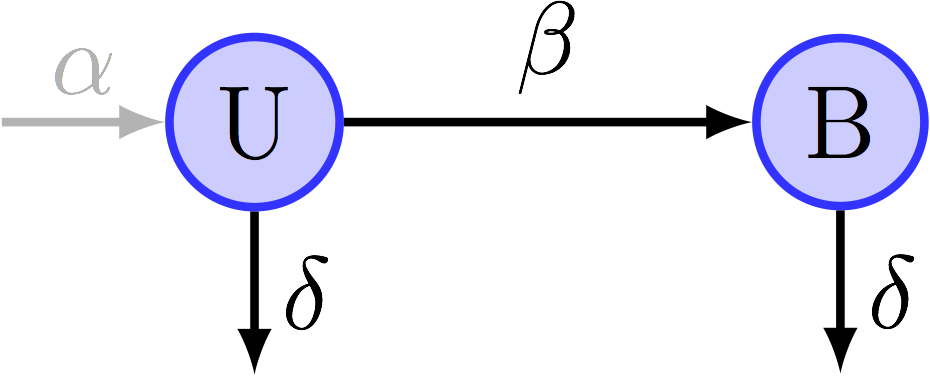

```{r knitr_settings, include=FALSE}
library(knitr)
opts_chunk$set(echo=FALSE, message=FALSE, warning=FALSE)

```


```{r variables}
# SET VARIABLES ####
dt <- 3             # frame intervall (min)
dl <- 0.065         # pixel size (µm)
vertical_cutoff <- 4 / dl   # after it touched this coordinate a cell is discarded
use_eriks_params <- TRUE

proj_path <- "~/Documents/Biozentrum/Projects/MoM_Switch"
r_scripts_path <- c("~/Documents/Biozentrum/Projects/vngWetLabR/mother_machine",
                  "~/Documents/Biozentrum/Projects/vngWetLabR/ggplot")
perl_scripts_path <- "~/Documents/Biozentrum/Projects/vngWetLabR/mother_machine"
data2preproc <- function(.d) sub('/(data_matthias|data_thomas)/*', '/preproc/', .d) # store cache file in preproc subdir

# # local paths
# proj_path <- "~/Downloads/january/MoM_Switch"
# r_scripts_path <- c("~/Downloads/january/vngWetLabR/mother_machine",
#                   "~/Downloads/january/vngWetLabR/ggplot")
# perl_scripts_path <- "~/Downloads/january/vngWetLabR/mother_machine"

date_cond <- c("20150616"="glucose", "20150617"="glucose", 
               "20150624"="lactose", "20150630"="lactose", 
               "20150703"="switch_4h", "20150708"="switch_4h",
               "20151204"="switch_6h",
               "20151207"="switch_iptg",
               "20151218"="switch_8h",
               "20151221"="switch_m9" )

condition_ts <- rbind(data.frame(duration=1560, medium='glucose', condition='glucose'),
                      data.frame(duration=1560, medium='lactose', condition='lactose'),
                      data.frame(duration=c(360, 240, 240, 240, 240, 240),
                                 medium=c('glucose', 'lactose', 'glucose', 'lactose', 'glucose', 'lactose'),
                                 condition='switch_4h'),
                      data.frame(duration=c(360, 240, 360, 240, 360, 240), 
                                 medium=c('glucose', 'lactose', 'glucose', 'lactose', 'glucose', 'lactose'),
                                 condition='switch_6h'),
                      data.frame(duration=c(360, 240, 480, 240, 480, 240), 
                                 medium=c('glucose', 'lactose', 'glucose', 'lactose', 'glucose', 'lactose'),
                                 condition='switch_8h'),
                      data.frame(duration=c(360, 240, 240, 240, 240, 240),
                                 medium=c('glucose', 'lactose+IPTG', 'glucose', 'lactose+IPTG', 'glucose', 'lactose+IPTG'),
                                 condition='switch_iptg'),
                      data.frame(duration=c(360, 120, 360, 720, 360, 240), 
                                 medium=c('glucose', 'M9', 'glucose', 'M9', 'glucose', 'M9'),
                                 condition='switch_m9') 
)

condition_ts <- condition_ts %>% group_by(condition) %>% 
  mutate(t_start=cumsum(c(0, duration[-(length(duration))])),
         t_end=cumsum(duration))

# SET ENVIRONMENT ####
invisible(sapply(
  list.files(r_scripts_path, pattern="\\.[Rr]$", full.names=TRUE, ignore.case=TRUE), 
  source, .GlobalEnv))
setwd(proj_path)

library(parallel)
numCores <- min(30, detectCores()-1) # do not use more than 30 cores

library(multidplyr)
mycluster <- create_cluster(numCores)
for (.l in mylibs) { mycluster %>% cluster_library(.l) }
# set_default_cluster(mycluster)


# SAVE ENVIRONMENT (but `pls`) ####
# myvars <- ls(all.names = TRUE)
# save(list=myvars[which(myvars!='pls')], file=".RData", envir=.GlobalEnv)

```


```{r load_mg_data}
mg_files <- list.files("./data_matthias/MG1655_glu_lac", ".*\\d+\\.csv", recursive=TRUE, full.names=TRUE)

# load perl scripts output to dataframes (using parallel lapply)
# NB: creating a list of dataframes and rbind them at last is faster than using rbind in a loop
l_data <- mclapply(mg_files, 
                function(.f) try( load_timm_data(.f, perl_scripts_path, .verbose=TRUE, .data2preproc=data2preproc, .force=FALSE)),
                mc.cores=numCores)

# mg_cells <- l_data %>% 
#   lapply(function(.l) .l$cells) %>% 
#   do.call(rbind, .) %>%
#   mutate(cell=paste(date, pos, gl, id, sep='.'))

mg_frames <- l_data %>% 
  lapply(function(.l) .l$frames) %>% 
  do.call(rbind, .) %>%
  mutate(time_sec=frame*dt*60, length_um=length_pixel*dl,
         discard_start=(time_sec < 2*3600),
         vertical_center=(vertical_bottom + vertical_top)/2,
         cell=paste(date, pos, gl, id, sep='.') ) %>% 
  group_by(date, pos, gl, id) %>%
  # remove frames after touching the exit
  group_by(date, pos, gl, id) %>%
  mutate(discard_top=which_touch_exit(vertical_top, vertical_cutoff)) %>%
  mutate(discard_top=ifelse(discard_start, FALSE, discard_top)) %>% # not in the preexpt step (2h)
  mutate(end_type=ifelse(any(discard_top), 'exit', end_type)) %>% # update end_type
  mutate(start_time=first(time_sec), end_time=last(time_sec),
         b_rank=round(mean(total_cell_in_lane - cell_num_in_lane))) %>% 
  # remove daughters of cells that touched the exit
  ungroup %>% group_by(date, pos, gl) %>%
  mutate(discard_top=which_to_progeny(discard_top, cid))
  #   filter(discard_top==FALSE) %>%

```


```{r load_ASC662_data}
asc_files <- c("./data_matthias/glucose", "./data_matthias/lactose", 
               "./data_matthias/glu_lac_switch", "./data_thomas/") %>% 
  list.files(".*\\d+\\.csv", recursive=TRUE, full.names=TRUE)

# load perl scripts output to dataframes (using parallel lapply)
# NB: creating a list of dataframes and rbind them at last is faster than using rbind in a loop
l_data <- mclapply(asc_files, 
                   function(.f) try( load_timm_data(.f, perl_scripts_path, .verbose=TRUE, .data2preproc=data2preproc, .force=FALSE)),
                   mc.cores=numCores) # 1

# mycells <- l_data %>% 
#   lapply(function(.l) if('cells' %in% names(.l)) .l$cells) %>% 
#   do.call(rbind, .) %>%
#   mutate(condition=date_cond[as.character(date)]) %>%
#   mutate(discard_start= (start_time < 2*3600) )

myframes <- l_data[1:3] %>% 
  mclapply(function(.l) {
    if ('frames' %in% names(.l)) {
      .l$frames %>%
        mutate(time_sec=frame*dt*60, length_um=length_pixel*dl,
               discard_start=(time_sec < 2*3600)) %>% 
        # remove frames after touching the exit
        group_by(id) %>%
        mutate(discard_top=which_touch_exit(vertical_top, vertical_cutoff)) %>% 
        mutate(discard_top=ifelse(discard_start, FALSE, discard_top)) %>% # not in the preexpt step (2h)
        mutate(end_type=ifelse(any(discard_top), 'exit', end_type)) %>% # update end_type
        # remove daughters of cells that touched the exit
        ungroup %>%
        mutate(discard_top=which_to_progeny(discard_top, cid))
      }
    }, mc.cores=numCores) %>% 
  do.call(rbind, .) %>%
  group_by(date, pos, gl, id) %>%
  mutate(start_time=first(time_sec), end_time=last(time_sec),
         b_rank=round(mean(total_cell_in_lane - cell_num_in_lane))) %>% 
  #   filter(discard_top==FALSE) %>%
  ungroup %>% 
  mutate(condition=date_cond[as.character(date)],
         vertical_center=(vertical_bottom + vertical_top)/2,
         cell=paste(date, pos, gl, id, sep='.'))

```


```{r}
# trying to load data using multidplyr

# # length(new_files) <- max(length(new_files), 2*numCores)
# myframes2 <- data_frame(path=asc_files) %>% 
#   group_by(path) %>% 
#   # partition(path, cluster=mycluster) %>% 
#   do((function(.df){
#     # browser()
#     .l <- try( load_timm_data(.df$path, perl_scripts_path, .verbose=TRUE, .data2preproc=data2preproc, .force=FALSE))
#     if ('frames' %in% names(.l)) {
#       return( .l$frames %>%
#                 mutate(time_sec=frame*dt*60, length_um=length_pixel*dl,
#                        discard_start=(time_sec < 2*3600)) %>% 
#                 # remove frames after touching the exit
#                 group_by(id) %>%
#                 mutate(discard_top=which_touch_exit(vertical_top, vertical_cutoff)) %>% 
#                 mutate(discard_top=ifelse(discard_start, FALSE, discard_top)) %>% # not in the preexpt step (2h)
#                 mutate(end_type=ifelse(any(discard_top), 'exit', end_type)) %>% # update end_type
#                 # remove daughters of cells that touched the exit
#                 ungroup %>%
#                 mutate(discard_top=which_to_progeny(discard_top, cid)) )
#     } else {
#       return (data.frame())
#     }
#   })(.)) %>% 
#   collect()

```


# Curation stats


```{r load_timm_data}
timm_files <- list.files("./data", "^\\d+_pos.*\\.timm$", recursive=TRUE, full.names=TRUE)

l_data <- lapply(timm_files, function(.f) try(parse_timm_curation(.f) %>%
                                                data.frame(path=.f, .)) )
timm_data <- lapply(l_data, function(.df) {
  if (class(.df) == 'try-error') return(data.frame())
  # keep only the first line of a frame for each SSCxAction events
  # combine it (using rbind) with all other events
  rbind(.df %>% 
          filter(type=='SSC') %>%
          group_by(frame, action) %>%
          summarise_each(funs(first)) %>%
          ungroup %>% 
          select(path, type, frame, action),
        filter(.df, type!='SSC') %>%
          select(path, type, frame, action) ) %>%
    arrange(type, frame)
  }) %>%
  do.call(rbind, .) %>%
  extract(path, c('date', 'pos', 'gl'), ".*/(\\d+)_pos(\\d+)_[^/]*GL0*(\\d+)\\.timm") %>%
  # to do: keep only files for which the output is used
  mutate(date=as.numeric(date), pos=as.numeric(pos), gl=as.numeric(gl))


mygl <- myframes %>%
  # start from the total number of observations
  group_by(condition, date, pos, gl) %>%
  filter(!discard_top, !discard_start) %>% 
  summarise(n_obs=n()) %>%
  # add the number of dividing cells
  left_join(myframes %>%
              group_by(date, pos, gl, id) %>% 
              filter(!discard_top, !any(discard_start), end_type=='div', row_number()==1) %>% 
              group_by(date, pos, gl) %>% 
              summarise(n_div_cells=n()) ) %>%
  # add the number of frames
  left_join(myframes %>%
              group_by(date, pos, gl) %>% 
              summarise(nframes=max(frame)) ) %>%
  # add curation times
  left_join(read.csv("./data_matthias/curation_times.csv", comment.char="#") %>%
              na.omit %>%
              mutate(pos=as.numeric(gsub('pos', '', pos)),
                     gl=as.numeric(gsub('GL', '', gl))) ) %>%
  # add the number of curated frames
  left_join(rbind(
    timm_data %>% 
      filter(type != 'none') %>%
      group_by(date, pos, gl) %>%
      summarise(n_cur_frames=length(unique(frame))),
    timm_data %>% 
      filter(type == 'none') %>%
      group_by(date, pos, gl) %>%
      summarise(n_cur_frames=0)) )

```


```{r}
kable(mygl %>%
  group_by(condition) %>%
  summarise(n_lanes=length(unique(interaction(date, pos, gl))),
            n_div_cells=sum(n_div_cells),
            n_obs=sum(n_obs),
            time_avg=mean(time, na.rm=TRUE),
            time_sd=sd(time, na.rm=TRUE) ))

```


```{r}
qplot(time/nframes*100, data=mygl, xlab='curation time (min; per 100 frames)', col=I('darkblue'), fill=I('darkblue'), alpha=I(.4))
ggsave('plots/curation_times_hist.pdf', width=4, height=3)

ggplot(data=mygl, aes(n_cur_frames/nframes*100, time/nframes*100)) +
  geom_smooth(method='lm', se=FALSE) +
  geom_point(position=position_jitter(width=.1)) +
  # geom_rug(sides='r', position=position_jitter(), size=5, alpha=.2) +
  # ylim(0, 20) +
  expand_limits(y=0) +
  labs(x='fraction of frames curated (%)', y='curation time (min; per 100 frames)')
ggsave('plots/curation_times_frames.pdf', width=4, height=3)

ggplot(data=filter(mygl, n_div_cells>40), aes(n_div_cells, time)) +
  geom_point(position=position_jitter(width=.1)) +
  geom_point(data=filter(mygl, n_div_cells>40) %>% ungroup %>% select(n_div_cells, time) %>% mutate_each(funs(as.numeric)) %>% summarise_each(funs(median(., na.rm=T))), col='red', pch='+', size=10) +
  # geom_rug(sides='r', position=position_jitter(), size=5, alpha=.2) +
  ylim(0, 20) +
  labs(x='number of entire cell cycles', y='curation time (min)')
ggsave('plots/curation_times_divcells.pdf', width=4, height=3)

```


# Fluorescence estimation

## Autofluorescence estimation

Let's look at how autofluorescence (measured as the fluorescence of MG1655 cells without GFP) correlates with cell length.

```{r autofluo}
ggplot(data=filter(mg_frames, !discard_top)) + 
  geom_point(aes(length_um, fluo_amplitude), size=1, alpha=.2, position=position_jitter(width=1e-2)) + 
  geom_smooth(aes(length_um, fluo_amplitude, col='y=ax'), method='lm', formula=y~x-1,
              data=filter(mg_frames, !discard_top, length_um>1.7, length_um<3.4))# +
  # xlim(0,6) + ylim(0, 3000)

ggplot(data=filter(mg_frames, !discard_top), aes(length_um, fluo_amplitude)) + 
  geom_point(size=1, alpha=.2, position=position_jitter(width=1e-2)) + 
  geom_smooth(method='lm', col='red', formula=y~x-1, fullrange=TRUE,
              data=filter(mg_frames, !discard_top, length_um>1.7, length_um<3.4))+
  labs(x='cell length (µm)', y='total fluorescence (AU)') +
  xlim(0,5) + ylim(0, 3000)
ggsave('plots/mg_autofluo_length.pdf', width=5, height=3)

```

Let's check visually that fluctuations for a given cell correlate with its length (rather than having some cells systematically high or low). Then, we look at cells with high autofluorescence values: we checked manually for some of these that they exhibit a hot pixel (contributing the size-independent "autofluorescence").

```{r}
# sample cell trace
ns <- 6
ggplot(data=filter(mg_frames, !discard_top, pos==0,  gl==14) %>% 
         filter(cell %in% unique(cell)[sample(1:40, ns)])) + 
  # geom_abline(slope=mean_autofluo$slope0) +
  geom_smooth(aes(length_um, fluo_amplitude), method='lm', col='black', formula=y~x-1, fullrange=TRUE,
              data=filter(mg_frames, !discard_top, length_um>1.7, length_um<3.4))+
  geom_path(aes(length_um, fluo_amplitude, col=cell), alpha=.5) + 
  xlim(1,4) + ylim(0, 3000)


autofl_outliers_cell <- filter(mg_frames, !discard_top, fluo_amplitude>2500, length_um<4) %>%
  ungroup %>% .[['cell']] %>% unique
ggplot(data=filter(mg_frames, !discard_top, cell %in% autofl_outliers_cell)) + 
  # geom_abline(slope=mean_autofluo$slope0) +
  geom_smooth(aes(length_um, fluo_amplitude), method='lm', col='black', formula=y~x-1, fullrange=TRUE,
              data=filter(mg_frames, !discard_top, length_um>1.7, length_um<3.4))+
  geom_path(aes(length_um, fluo_amplitude, col=cell), alpha=.5) + 
  xlim(1,4) + ylim(0, 3000)

```


We estimate the slope of each cell that is not filamenting (between 1.7 and 3.4µm) and that is observed over 5 frames or more.
These slopes display a strong negative correlation with the intercepts. Cells with non-zero intercepts might correspond to cells with hot/dead pixels. Overall, the default intercept is not zero (does this correspond to the sum of non-zero values of pixels in the dark?).

```{r}
nframes_autofluo <- 5
mg_autofluo <- filter(mg_frames, !discard_top, length_um>1.7, length_um<3.4) %>%
  group_by(date, pos, gl, id) %>%
  mutate(npoints=n()) %>% filter(npoints>=nframes_autofluo) %>%
  do(mod0=lm(fluo_amplitude~length_um-1, data=.), mod=lm(fluo_amplitude~length_um, data=.)) %>%
  mutate(intercept=coef(mod)[1], slope=coef(mod)[2], slope.sd=summary(mod)$coeff[2, 2], 
         slope0=coef(mod0)[1], slope0.sd=summary(mod0)$coeff[1, 2],
         r2=summary(mod)$r.squared, r2_0=summary(mod0)$r.squared)

ggplot(mg_autofluo, aes(intercept, slope)) +
  geom_errorbar(aes(ymin=slope-slope.sd, ymax=slope+slope.sd), alpha=0.2) +
  geom_point(alpha=0.2) +
  geom_vline(xintercept=c(-500, 900), col='red')

qplot(intercept, data=mg_autofluo) +
  geom_vline(xintercept=c(-500, 900), col='red')

```

Overall the fit is much better for a model constrained through the origin?! This yields a narrower distribution of slopes. We use this model and estimate the average slope (using errors) to predict the autofluorescence at a given cell length.

```{r}
ggplot(filter(mg_autofluo, between(intercept, -500, 900))) +
  stat_ecdf(aes(r2_0, col='Y=aX')) +
  stat_ecdf(aes(r2, col='Y=aX+b')) +
  labs(x='r2', y='cumulative', col='model')

mean_autofluo <- mg_autofluo %>% ungroup %>%
  summarise(slope0=sqrt( sum(slope0^2/slope0.sd^2) / sum(1/slope0.sd^2) ), 
            slope0.sd=1 / sqrt(sum(1/slope0.sd^2)))

ggplot(filter(mg_autofluo, between(intercept, -500, 900))) +
  # geom_step_hist(aes(slope0, col='Y=aX')) +
  # geom_step_hist(aes(slope, col='Y=aX+b')) +
  stat_ecdf(aes(slope0, col='Y=aX')) +
  stat_ecdf(aes(slope, col='Y=aX+b')) +
  geom_vline(aes(xintercept=slope0, col='Y=aX'), data=mean_autofluo, lty='dashed') +
  labs(x='slope (DN/µm)', y='cumulative', col='model')

autofluo_predict <- function(.h) .h * mean_autofluo$slope0
if (use_eriks_params)
  autofluo_predict <- function(.h) .h * 422.8
myframes <- myframes %>%
    mutate(fluogfp_amplitude = fluo_amplitude - autofluo_predict(length_um))

```


The autofluorescence concentration is noticeably impacted by the extracellular conditions. For instance, it increases dramatically when the environment is switched to lactose. Are the intial and post-switch decreases due to bleaching?

```{r}
ggplot(data=filter(mg_frames, !discard_top) %>% head(1e4), aes(time_sec, fluo_amplitude/length_um)) + 
  geom_rect(aes(x=1, y=1, xmin=12*3600, xmax=24*3600, ymin=-Inf, ymax=Inf, fill='lactose'), alpha=.1, data=data.frame()) + # draws one rectangle per data line
  geom_hline(yintercept=mean_autofluo$slope0, lty='dashed') +
  geom_point(alpha=.2, size=1) +
  geom_smooth(method='loess', span=.05, se=FALSE) +
  scale_x_hours() +
  ylim(0, 1e3) +
  labs(x='time (h)', y='autofluorescence \nconcentration (DN/µm)', fill='condition')
ggsave('plots/mg_autofluoconc_time.pdf', width=6, height=3)

```


## Photobleaching estimation

### Rationale
We assume that fluorescent proteins (FPs) are present in two states: unbleached (U) and bleached (B). FPs are produced as unbleached at a rate $\alpha$. Unbleached proteins are bleached at a rate $\beta$ and all proteins are degraded at a rate $\delta$. The total fluorescence measured in a cell is proportional to U. \
NB: the assumption that the probablity of degradation is constant with time is not realistic, contrary to the assumption of a constant rate of bleaching. \


When FPs are produced (lactose): $\frac{dU}{dt} = \alpha - (\beta + \delta) U$ \
When no FPs are produced (glucose): $\frac{dU}{dt} = -(\beta + \delta) U$ \

When no FPs are produced, the total fluorescence decreases rapidly (though the total number of FPs is expected to be constant). This is a direct observation of photobleaching and protein degradation and we can estimate $\beta + \delta$ as the decay rate of U. We also use this regime to estimate the conversion factor between camera units and FP units. In this case, the partitioning can be better estimated by extrapolating the mother and daughters fluorescence at division between the 2 adjacent time points (based on the exponential decay model).

When FPs are produced, $U(t+dt) = U(t) - (\beta + \delta) dt U(t) + \alpha(t) dt (\beta + \delta) dt$. \
$\alpha = (U(t+dt) - U(t) + (\beta + \delta) dt U(t)) / (\beta + \delta) dt^2$
Hence knowing the bleaching and degradation rate, one can estimate the instantaneous production rate \alpha(t)
NB: means that average production rate over the cell cycle not taking bleaching and degradation into account are correct up to a constant.


### Estimation

We focus on estimating $\beta + \delta$ and aim at extrapolating the mother and daughters fluorescence at division between the 2 adjacent time points.

Let's first look at fluorescence decay for cells in a given lane. The slopes are steeper for more fluorescent cells, which suggests proportional decay (as expected). This is nicely confirmed by constant slope in log scale.

```{r}
ts <- filter(condition_ts, condition=='switch4h', medium=='glucose')$t_start
te <- filter(condition_ts, condition=='switch4h', medium=='glucose')$t_end

p_decayGFP_lin <- ggplot(data = filter(myframes, !discard_start, !discard_top, condition=='switch4h', end_type=='div', time_sec>(2+4)*3600, 
                                       # fluogfp_amplitude > autofluo_predict(length_um),
                     between_or(time_sec, (ts+30)*60, (te-30)*60) ) %>% 
         mutate(glid=paste(date, pos, gl, sep='.')) %>% filter(glid %in% nth(unique(glid), 11)) %>%
         group_by(date, pos, gl, id) %>% 
         filter(n() > 3) %>% # display cells with more than 3 points only
         mutate(time_sec_ini=first(time_sec)), 
       aes(time_sec - time_sec_ini, fluogfp_amplitude, col=cell)) +
  geom_path(alpha=0.6) +
  expand_limits(y=0) +
  scale_colour_periodic_brewer(guide='none') +
  scale_x_hours(0.5, name='time after switch / birth (h)') +
  labs(y='GFP level (AU)') +
  theme_classic()
  
p_decayGFP_exp <- p_decayGFP_lin +
  scale_y_continuous(trans='log10', breaks=c(5e3, 1e4, 2e4, 4e4))

bleaching_fits <- filter(myframes, !discard_start, !discard_top, condition=='switch4h', 
                         time_sec>(2+4)*3600, # end_type=='div',
                         between_or(time_sec, (ts+30)*60, (te-30)*60) ) %>% 
  group_by(date, pos, gl, id) %>% 
  mutate(npoints=sum(fluogfp_amplitude>0)) %>%
  filter(npoints>10,
         mean(fluogfp_amplitude) > mean(autofluo_predict(length_um))) %>%
  do(npoints=first(.$npoints), time_sec_ini=first(.$time_sec), fluogfp_amplitude_ini=first(.$fluogfp_amplitude),
     mod_lin=lm(fluogfp_amplitude~time_sec, data=.), mod_exp=lm(log(fluogfp_amplitude)~time_sec, data=.)) %>%
  mutate(npoints=unlist(npoints), time_sec_ini=unlist(time_sec_ini),
         fluogfp_amplitude_ini=unlist(fluogfp_amplitude_ini),
         slope=summary(mod_lin)$coeff[2], r2=summary(mod_lin)$r.squared,
         slope.sd=summary(mod_lin)$coeff[2, 2],
         exp_slope=summary(mod_exp)$coeff[2], exp_r2=summary(mod_exp)$r.squared,
         exp_slope.sd=summary(mod_exp)$coeff[2, 2]) %>%
  ungroup %>%
  mutate(cell=paste(date, pos, gl, id, sep='.'))

```

We fit the decay (accounting for the cell autofluorescence) for each cell observed on 10 frames or more and with GFP fluorescence greater than the predicted autofluorescence. Surprinsingly, exponential fits do not have higher r2 than linear fits. However, the distribution of slopes is narrower with the exponential model.

```{r}
p_decayfit_r2_ecdf <- ggplot(data = bleaching_fits) +
  stat_ecdf(aes(r2, col='linear')) +
  stat_ecdf(aes(exp_r2, col='exponential')) +
  xlim(0, 1) +
  labs(col='fit', x='Pearson correlation decay fit', y='fraction cell cycles') +
  theme_classic() + theme(legend.position=c(0.2, 0.85))
ggsave('plots/article/decayfit_r2_ecdf.pdf', p_decayfit_r2_ecdf, width=4, height=3)

# .bw <- .1
# ggplot(data = filter(bleaching_fits, r2>.8)) +
#   geom_step_hist(aes(slope/mean(slope), col='lin'), binwidth=.bw) +
#   geom_step_hist(aes(exp_slope/mean(exp_slope, na.rm=T), col='exp'), binwidth=.bw)

ggplot(data = filter(bleaching_fits, r2>.8)) +
  stat_ecdf(aes(slope/mean(slope), col='lin')) +
  stat_ecdf(aes(exp_slope/mean(exp_slope, na.rm=T), col='exp'))


```

This can be explained by the fact that each cell spans a relatively narrow range of fluorescence (where linear and exponential decay are comparable) during its cell cycle. Hence the quality of the fit is dominated by experimental errors rather than by the overall shape. Moreover the broader distribution of slopes with the linear model can be explained by the fact that the slope scales with the total fluorescence in the linear model while the decay rate doesn't.

```{r}
p_decayfit_lin <- ggplot(bleaching_fits, aes(fluogfp_amplitude_ini, slope)) +
    geom_errorbar(aes(ymin=slope-slope.sd/sqrt(npoints), ymax=slope+slope.sd/sqrt(npoints)), col=brewer_cols[1], alpha=.2, size=.2) +
  geom_point(col=brewer_cols[1], alpha=.2, size=1) + 
  geom_line(stat='smooth', method='lm', se=FALSE, col='black', alpha=.5) +
  labs(x='GFP level at birth (AU)', y='decay slope (linear fit)') +
  theme_classic()
ggsave('plots/article/decayfit_lin.pdf', p_decayfit_lin, width=4, height=3)

p_decayfit_exp <- ggplot(filter(bleaching_fits, exp_slope<1e-4), aes(fluogfp_amplitude_ini, exp_slope)) +
    geom_errorbar(aes(ymin=exp_slope-exp_slope.sd/sqrt(npoints), ymax=exp_slope+exp_slope.sd/sqrt(npoints)), col=brewer_cols[2], alpha=.2, size=.2) +
  geom_point(col=brewer_cols[2], alpha=.2, size=1) + 
  stat_smooth(method='lm', se=FALSE, geom='line', col='black', alpha=.5) + # , aes(weight=(exp_slope.sd/sqrt(npoints))^(-2))
  scale_y_continuous(labels = comma) +
  labs(x='GFP level at birth (AU)', y='decay rate (exp. fit)') +
  theme_classic()
ggsave('plots/article/decayfit_exp.pdf', p_decayfit_exp, width=4, height=3)

# pdf('plots/article/decay_gfp.pdf', width=10, height=3)
# grid.arrange(p_decayGFP_lin, p_decayGFP_exp, ncol=2)
# dev.off()

# pdf('plots/article/decay_fit.pdf', width=12, height=3)
# grid.arrange(p_decayfit_r2_ecdf, p_decayfit_lin, p_decayfit_exp, ncol=3)
# dev.off()

```

We compute the average decay by taking the slope errors into account:

```{r}
bleaching_rate <- bleaching_fits %>%
  ungroup %>%
  summarise(mean=-sqrt( sum(exp_slope^2/exp_slope.sd^2) / sum(1/exp_slope.sd^2) ), 
            sd=1 / sqrt(sum(1/exp_slope.sd^2)))

ggplot(data = bleaching_fits) +
  geom_histogram(aes(exp_slope), fill='gray35') +
  geom_vline(xintercept=bleaching_rate$mean) +
  labs(x='bleaching + decay rate (/s)')

p_decayfit_exp2 <- p_decayfit_exp +
  geom_hline(yintercept=bleaching_rate$mean, col=brewer_cols[2], lty='dashed')
pdf('plots/article/decay_fit.pdf', width=12, height=3)
grid.arrange(p_decayfit_r2_ecdf, p_decayfit_lin, p_decayfit_exp2, ncol=3)
dev.off()

```


## GFP conversion factor estimation

For each division event (where mother and both daughters are observed for 10 frames or more; discarding bottom cell), we estimate the fluorescence and size at division. On one hand, we do it by average ing the last and first 3 frames around division; on the other hand, we do it by fitting the previously characterized exponential decay for the fluorescence and a free exponential growth for the size to the last and first 10 frames around division.

Reassuringly, while the daughters sum is systematically lower than their mother (due to bleaching + degradation) with the average estimation, the sum is closer to the mother value with the fit. In the following we assume these are equal and use the sum to compute the bias since this is less subject to measurement errors. Regarding the size estimation, the fit underestimate size at birth as already established by Erik.

```{r}
ggplot(data = filter(myframes, !discard_start, !discard_top, condition=='switch4h', 
                     cell_num_in_lane < total_cell_in_lane,
                     time_sec>(2+4)*3600, 
                     between_or(time_sec, (ts+30)*60, (te-30)*60)) %>% 
         mutate(glid=paste(date, pos, gl, sep='.')) %>% filter(glid %in% nth(unique(glid), 10)) %>%
         group_by(date, pos, gl, id) %>% 
         mutate(npoints=sum(fluogfp_amplitude>0)) %>%
         filter(npoints>10) %>%
         mutate(time_sec_ini=first(time_sec)), 
       aes(time_sec, fluogfp_amplitude, col=cell)) +
  geom_path(alpha=0.6) +
  expand_limits(y=0) +
  scale_colour_periodic_brewer(guide='none') +
  scale_x_hours(2) 


triad_avgw <- 3
triad_fitw <- 10
set.seed(19082328)
swi_triads <- filter(myframes, !discard_start, !discard_top, condition=='switch4h', 
                     cell_num_in_lane < total_cell_in_lane,
                     time_sec>(2+4)*3600, 
                     between_or(time_sec, (ts+30)*60, (te-30)*60)) %>%
  group_by(date, pos, gl) %>%
  do( (function(.df1){
    # first loop on all growth lanes
    filter(.df1, end_type=="div") %>%
      group_by(id, genealogy) %>%
      filter(mean(fluogfp_amplitude) > mean(autofluo_predict(length_um))) %>%
      do( (function(.df1, .dfp){
          # then loop on all cells
         .dfp <- mutate(.dfp, time_to_div = time_sec - (last(time_sec)+dt/2*60))
         if (sum(.dfp$fluogfp_amplitude>0) < max(triad_avgw, triad_fitw)) return(data.frame())
         .dfcb <- filter(.df1, parent_id==unique(.dfp$id), daughter_type=='BOTTOM') %>%
           mutate(time_from_birth = time_sec - (first(time_sec)-dt/2*60))
         if (sum(.dfcb$fluogfp_amplitude>0) < max(triad_avgw, triad_fitw)) return(data.frame())
         .dfct <- filter(.df1, parent_id==unique(.dfp$id), daughter_type=='TOP') %>%
           mutate(time_from_birth = time_sec - (first(time_sec)-dt/2*60))
         if (sum(.dfct$fluogfp_amplitude>0) < max(triad_avgw, triad_fitw)) return(data.frame())

         length_modp <- fastLmPure(cbind(1, .dfp$time_to_div), log(.dfp$length_um))
         .dfp <- mutate(.dfp, length_div = length_um / exp(length_modp$coefficients[2] * time_to_div),
                        fluogfp_div = fluogfp_amplitude / exp( bleaching_rate$mean * time_to_div))
         length_modcb <- fastLmPure(cbind(1, .dfcb$time_from_birth), log(.dfcb$length_um))
         .dfcb <- mutate(.dfcb, length_birth = length_um / exp(length_modcb$coefficients[2] * time_from_birth),
                         fluogfp_birth = fluogfp_amplitude / exp( bleaching_rate$mean * time_from_birth))
         length_modct <- fastLmPure(cbind(1, .dfct$time_from_birth), log(.dfct$length_um))
         .dfct <- mutate(.dfct, length_birth = length_um / exp(length_modct$coefficients[2] * time_from_birth),
                         fluogfp_birth = fluogfp_amplitude / exp( bleaching_rate$mean * time_from_birth))
         # browser()       
# #          qplot(time_to_div, fluogfp_div, data=.dfp, col='div') + geom_point(aes(y=fluogfp_amplitude, col='raw'))
#          ggplot(.dfcb, aes(time_from_birth, log(fluogfp_amplitude), col='raw')) +
#            geom_point() +
#            geom_point(aes(y=log(fluogfp_birth), col='birth')) +
#            geom_hline(aes(colour='birth'), yintercept=log(mean(.dfcb$fluogfp_birth))) +
#            stat_smooth(method='lm', se=FALSE, fullrange=TRUE) +
#            geom_abline(slope=bleaching_rate$mean, intercept=log(mean(.dfcb$fluogfp_birth)))
#          ggplot(.dfct, aes(time_from_birth, log(fluogfp_amplitude), col='raw')) +
#            geom_point() +
#            geom_point(aes(y=log(fluogfp_birth), col='birth')) +
#            geom_hline(aes(colour='birth'), yintercept=log(mean(.dfct$fluogfp_birth))) +
#            stat_smooth(method='lm', se=FALSE, fullrange=TRUE) +
#            geom_abline(slope=bleaching_rate$mean, intercept=log(mean(.dfct$fluogfp_birth)))
# #          qplot(time_from_birth, log(fluogfp_birth), data=.dfct, col='birth') + 
# #            geom_point(aes(y=log(fluogfp_amplitude), col='raw'))
         
         bind_cols(
           filter(.dfp, row_number() > dim(.dfp)[1] - triad_avgw) %>%
             select(end_time, length_avg=length_um, fluo_avg=fluogfp_amplitude) %>%
             summarise_each(funs(mean)) %>%
             mutate(div_time=unique(.dfp$end_time)+dt/2*60, n_fit=dim(.dfp)[1],
                    fluo_fit=mean(.dfp$fluogfp_div), fluo_fit_sd=sd(.dfp$fluogfp_div)*sqrt((n_fit-1)/n_fit),
                    length_fit=mean(.dfp$length_div), length_fit_sd=sd(.dfp$length_div)*sqrt((n_fit-1)/n_fit)),
           
           filter(.dfcb, row_number() <= triad_avgw) %>%
             group_by(id, genealogy) %>% select(length_avg=length_um, fluo_avg=fluogfp_amplitude) %>%
             summarise_each(funs(mean)) %>%
             # mutate(n_fit=dim(.dfcb)[1], pole=ifelse(str_detect(genealogy, "(?<=B)B$|(?<=T)T$"), "old", "new"),
             mutate(n_fit=dim(.dfcb)[1], pole=ifelse(str_detect(genealogy, "B{2,}$|T{2,}$"), "old", "new"),
                    fluo_fit=mean(.dfcb$fluogfp_birth), fluo_fit_sd=sd(.dfcb$fluogfp_birth)*sqrt((n_fit-1)/n_fit),
                    length_fit=mean(.dfcb$length_birth), length_fit_sd=sd(.dfcb$length_birth)*sqrt((n_fit-1)/n_fit)) %>%
             setNames(., paste("b", names(.), sep=".")),
           
           filter(.dfct, row_number() <= triad_avgw) %>%
             group_by(id, genealogy) %>% select(length_avg=length_um, fluo_avg=fluogfp_amplitude) %>%
             summarise_each(funs(mean)) %>%
             mutate(n_fit=dim(.dfct)[1], pole=ifelse(str_detect(genealogy, "B{2,}$|T{2,}$"), "old", "new"),
                    fluo_fit=mean(.dfct$fluogfp_birth), fluo_fit_sd=sd(.dfct$fluogfp_birth)*sqrt((n_fit-1)/n_fit),
                    length_fit=mean(.dfct$length_birth), length_fit_sd=sd(.dfct$length_birth)*sqrt((n_fit-1)/n_fit)) %>%
             setNames(., paste("t", names(.), sep="."))
         )
       })(.df1, .) )
  })(.) ) %>% 
  # add convenience variables
  ungroup %>% 
  mutate(fbias_bottom=b.fluo_fit / (b.fluo_fit + t.fluo_fit),
         lbias_bottom=b.length_fit / (b.length_fit + t.length_fit),
         lbias_old=ifelse(b.pole=="old", lbias_bottom, 1-lbias_bottom),
         fbias_old=ifelse(b.pole=="old", fbias_bottom, 1-fbias_bottom),
         rnd=runif(dim(.)[1])<0.5, lbias_rnd=ifelse(rnd, lbias_bottom, 1-lbias_bottom),
         fbias_rnd=ifelse(rnd, fbias_bottom, 1-fbias_bottom) )

# write.csv(swi_triads %>% data.frame, file='nu_triads_20151230.csv')

ggplot(swi_triads) +
  geom_point(aes(fluo_avg, b.fluo_avg+t.fluo_avg, col='avg'), alpha=.5) +
  geom_errorbar(aes(fluo_fit, b.fluo_fit+t.fluo_fit, col='fit',
                    ymin=b.fluo_fit+t.fluo_fit - (b.fluo_fit_sd/sqrt(b.n_fit)+t.fluo_fit_sd/sqrt(t.n_fit)), 
                    ymax=b.fluo_fit+t.fluo_fit + (b.fluo_fit_sd/sqrt(b.n_fit)+t.fluo_fit_sd/sqrt(t.n_fit))), alpha=.5) +
  geom_point(aes(fluo_fit, b.fluo_fit+t.fluo_fit, col='fit'), alpha=.5) + 
  geom_abline() +
  labs(col='estimation')

ggplot(swi_triads) +
  geom_point(aes(length_avg, b.length_avg+t.length_avg, col='avg'), alpha=.5) +
  geom_point(aes(length_fit, b.length_fit+t.length_fit, col='fit'), alpha=.5) + 
  geom_abline() +
  labs(col='estimation')

```


```{r}
ggplot(data=swi_triads, aes(b.fluo_fit + t.fluo_fit , fbias_rnd)) +
  geom_hline(yintercept=0.5, lty='dashed') + 
  # stat_density2d(fill='blue', col='transparent', alpha=.05, geom='polygon') + # , binwidth=1e-4
  geom_point(alpha=0.5, size=1) + 
  ylim(0.35, .65) +
#   geom_pointrange(aes(x=fluo, y=m, ymin=m-s, ymax=m+s), 
#                   data=data.frame(fluo=seq(5e3, 4e4, 1e3)) %>% mutate(
#                     m=sapply(fluo, function(.fl) 
#                       filter(swi_triads, between(fluo_fit, .fl-1e3, .fl+1e3)) %>% mutate(bias=b.fluo_fit / (b.fluo_fit + t.fluo_fit)) %>% .[['bias']] %>% mean),
#                     s=sapply(fluo, function(.fl) 
#                       filter(swi_triads, between(fluo_fit, .fl-1e3, .fl+1e3)) %>% mutate(bias=b.fluo_fit / (b.fluo_fit + t.fluo_fit)) %>% .[['bias']] %>% sd)) ) +
  labs(x='total fluorescence (DN)', y='GFP bias toward daughter 1')
ggsave('plots/asc_nutriads_fluotot.pdf', width=3.9, height=2.9)

ggplot(data=swi_triads, aes(lbias_rnd, fbias_rnd)) +
  geom_hline(yintercept=0.5, lty='dashed') + 
  geom_smooth(method='lm', se=TRUE) + 
  geom_point(alpha=0.5, size=1) + 
  xlim(0.42, 0.58) +
  labs(x='length bias toward daughter 1', y='GFP bias toward daughter 1') 
ggsave('plots/asc_nutriads_length.pdf', width=3.9, height=2.9)

ggplot(swi_triads, aes(lbias_rnd, fbias_rnd-lbias_rnd)) +
  geom_hline(yintercept=0, lty='dashed') + 
  geom_smooth(method='lm', se=TRUE) + 
  geom_point(alpha=0.5, size=1) + 
  xlim(0.42, 0.58) +
  labs(x='volume bias toward daughter 1', y='volume-corrected \nGFP bias toward daughter 1') 
ggsave('plots/asc_nutriads_lengthcor.pdf', width=3.9, height=2.9)

# # manually check the effect of random assignement on the r2
# swi_triads %>% ungroup %>% 
#   mutate(fbias_bottom=b.fluo_fit / (b.fluo_fit + t.fluo_fit),
#          lbias_bottom=b.length_fit / (b.length_fit + t.length_fit),
#                          rnd=runif(dim(.)[1])<0.5, lbias_rnd=ifelse(rnd, lbias_bottom, 1-lbias_bottom),
#                 fbias_rnd=ifelse(rnd, fbias_bottom, 1-fbias_bottom) ) %>% 
#   summarise(r2_lb_fb=cor(lbias_bottom, fbias_bottom, use="complete.obs", method="pearson")^2,
#             r2_lb_cfb=cor(lbias_bottom, fbias_bottom-lbias_bottom, use="complete.obs", method="pearson")^2,
#             r2_lr_fr=cor(lbias_rnd, fbias_rnd, use="complete.obs", method="pearson")^2,
#             r2_lr_cfr=cor(lbias_rnd, fbias_rnd-lbias_rnd, use="complete.obs", method="pearson")^2)

ggplot(swi_triads %>%
         # filter(between(b.fluo_fit + t.fluo_fit, 5e3, 3e4)) %>% 
         filter(b.fluo_fit + t.fluo_fit > 5e3) ) +
  geom_hline(yintercept=0, lty='dashed') +
#   stat_smooth(aes(b.fluo_fit+t.fluo_fit, fbias_rnd-lbias_rnd, col="random"), method="lm") +
#   geom_point(aes(b.fluo_fit+t.fluo_fit, fbias_rnd-lbias_rnd, col="random"), alpha=.5) +
  # geom_hline(aes(yintercept=mean(fbias_rnd-lbias_rnd), col="random")) +
  stat_smooth(aes(b.fluo_fit+t.fluo_fit, fbias_bottom-lbias_bottom, col="bottom"), method="lm", show.legend=FALSE) +
  geom_point(aes(b.fluo_fit+t.fluo_fit, fbias_bottom-lbias_bottom, col="bottom"), alpha=.5) +
  # geom_hline(aes(yintercept=mean(fbias_bottom-lbias_bottom), col="bottom")) +
  stat_smooth(aes(b.fluo_fit+t.fluo_fit, fbias_old-lbias_old, col="old"), method="lm", show.legend=FALSE) +
  geom_point(aes(b.fluo_fit+t.fluo_fit, fbias_old-lbias_old, col="old"), alpha=.5) +
  # geom_hline(aes(yintercept=mean(fbias_old-lbias_old), col="old")) +
  labs(x="mother's total GFP (molecules)", y="volume-corrected GFP bias", col="criteria") +
  theme(legend.justification=c(1,1), legend.position=c(1, 1)) +
  guides(col=guide_legend(override.aes = list(size=3, alpha=1)))
ggsave('plots/asc_nutriads_oldpolebias.pdf', width=4, height=4)

# table(swi_triads$b.pole=="old")

```

For each triad, we can compute a conversion factor (cf Rosenfeld method 1).

```{r}
swi_triads <- swi_triads %>%
  mutate(nu=(b.fluo_fit - t.fluo_fit)^2 / ((b.fluo_fit + t.fluo_fit)),
         fluo_bin=cut2(fluo_fit, cuts=seq(0, 1e5, 5e3), oneval=FALSE)) # fluo_bin2=Hmisc::cut2(fluo_fit, g=7, oneval=FALSE)
nu_star <- mean(swi_triads$nu, na.rm=TRUE) # DN per FP
nu_err <- nu_star / sqrt(dim(swi_triads)[1])

```

or use Erik's method accounting for fluctuations in size.

```{r eval=FALSE}
partitioning_nosize_loglik <- function(.lambda, .v, .x, .y) {
  if (length(.x) != length(.y)) stop('.x and .y must have the same length')
  .a <- .v + 1 / (4*.lambda * (.x+.y))
  sum( - (.x/(.x+.y) -.5)^2 / .a - log(.a), na.rm=TRUE)
}
partitioning_nosize_loglik_wrapper <- function(.pars, .x, .y)
  partitioning_nosize_loglik(.pars[1], .pars[2], .x, .y)

partitioning_nosize_opt <- with(swi_triads,
                         optim(c(.1, 1e-4), partitioning_nosize_loglik_wrapper, control = list(fnscale = -1),
                               .x=swi_triads$b.fluo_fit, .y=swi_triads$t.fluo_fit) )
# if (partitioning_nosize_opt$convergence == 0) { fp_per_dn <- partitioning_nosize_opt$par[1]} else { rm('fp_per_dn') }

```


```{r}
partitioning_loglik <- function(.lambda, .v, .x, .y, .r) {
  if (length(.x) != length(.y) || length(.x) != length(.r)) stop('.x, .y and .r must have the same length')
  .a <- .v + (.r * (1-.r)) / (.lambda * (.x+.y))
  -sum( (.x/(.x+.y) - .r)^2 / .a + log(.a), na.rm=TRUE)
}
partitioning_loglik_wrapper <- function(.pars, .x, .y, .r)
  partitioning_loglik(.pars[1], .pars[2], .x, .y, .r)

partitioning_opt <- with(swi_triads,
                                  optim(c(.1, 1e-4), partitioning_loglik_wrapper, control = list(fnscale = -1),
                                   .x=b.fluo_fit, .y=t.fluo_fit, .r=b.length_fit/(b.length_fit+t.length_fit)) )
fp_per_oligomers <- 4 # lacZ is tetrameric
if (partitioning_opt$convergence == 0) { fp_per_dn <- partitioning_opt$par[1] * fp_per_oligomers} else { rm('fp_per_dn') }
if (use_eriks_params)
  fp_per_dn <- 0.0361 * fp_per_oligomers
```


```{r}
# work in progress: hunting for the difference with Erik

with(swi_triads,
    partitioning_loglik(10^(-2.13), 10^(-2.67),
      .x=b.fluo_fit, .y=t.fluo_fit, .r=b.length_fit/(b.length_fit+t.length_fit)) )

# ls <- seq(1e-5, 1e-1, length.out=200)
# vs <- seq(1e-3, 1e0, length.out=200)
ls <- 10^seq(-3, -1, length.out=200)
vs <- 10^seq(-5, -2, length.out=200)

lls <- with(swi_triads,
            outer(ls, vs, Vectorize(partitioning_loglik, c('.lambda', '.v')),
                  .x=b.fluo_fit, .y=t.fluo_fit, .r=b.length_fit/(b.length_fit+t.length_fit)) )
contour(log10(ls), log10(vs), lls)
plot_ly(x=log10(ls), y=log10(vs), z=t(lls), type="surface") #, transpose=TRUE)


partitioning_opt <- with(swi_triads,
                                  optim(c(.1, 1e-4), partitioning_loglik_wrapper, control = list(fnscale = -1),
                                   .x=b.fluo_fit, .y=t.fluo_fit, .r=b.length_fit/(b.length_fit+t.length_fit)) )
```


This yields a conversion factor FP/DN at `r format(fp_per_dn, digits=2)`. The sd of the volume bias is infered to be `r sqrt(partitioning_opt$par[2]) %>% format(digits=2)` while it is measured at `r (swi_triads$b.length_fit / (swi_triads$b.length_fit+swi_triads$t.length_fit)) %>% sd %>% format(digits=2)`.


We can now look at how the fluorescence measurement convert to number of gfp molecules.

```{r}

myframes <- myframes %>%
  # convert to gfp units (after subtracting autofluorescence)
  mutate(gfp_nb = fluogfp_amplitude * fp_per_dn)

ggplot(data=myframes %>% filter(!discard_top, condition=='glucose') %>% head(1e5),
       aes(fluo_amplitude, gfp_nb)) +
  geom_point(alpha=0.1) 

ggplot(data=myframes %>% filter(!discard_top, condition=='lactose', length_um<3) %>% head(1e5),
       aes(fluo_amplitude, gfp_nb)) +
  geom_point(alpha=0.1) 

qplot(gfp_nb, data=myframes %>% filter(!discard_top, condition=='lactose', length_um<3), binwidth=50)
qplot(length_um, gfp_nb, data=myframes %>% filter(!discard_top, condition=='lactose', length_um<3), alpha=I(.01))
```


# Control plots

```{r}
# Plot overall experiment
compute_div_between_facets <- function(.df1, .df2){
  # then loop on all cells
  if (unique(.df2$parent_id) < 0) return(data.frame())
  # browser()
  .dfp <- filter(.df1, id==unique(.df2$parent_id))
  
  if (unique(.df2$b_rank) == unique(.dfp$b_rank)) {
    .length_ump <- filter(.dfp, time_sec==max(time_sec))$length_um
    .gfp_nbp <- filter(.dfp, time_sec==max(time_sec))$gfp_nb
    .out <- filter(.df2, time_sec==min(time_sec)) %>% 
      select(id, b_rank, time_sec, length_um, gfp_nb) %>% 
      mutate(time_secp=time_sec-dt*60, length_ump=.length_ump, gfp_nbp=.gfp_nbp)
  } 
  if (unique(.df2$b_rank) > unique(.dfp$b_rank)) { 
    .out <- bind_rows(
      filter(.df2, time_sec==min(time_sec)) %>% 
        select(id, b_rank, time_sec, length_um, gfp_nb) %>% 
        mutate(time_secp=time_sec-dt*60/2, length_ump=0, gfp_nbp=-Inf),
      filter(.dfp, time_sec==max(time_sec)) %>% 
        select(id, b_rank, time_sec, length_um, gfp_nb) %>% 
        mutate(id=unique(.df2$id), time_secp=time_sec+dt*60/2, length_ump=Inf, gfp_nbp=Inf) )
    if(diff(.out$b_rank) < -1) {
      .out <- rbind(.out,
                    data.frame(id=unique(.df2$id), b_rank=(min(.out$b_rank)+1):(max(.out$b_rank)-1),
                               time_sec=min(.df2$time_sec)-dt*60/2, time_secp=min(.df2$time_sec)-dt*60/2,
                               length_um=0, length_ump=Inf, gfp_nb=-Inf, gfp_nbp=Inf))
    }
  }
  return(.out)
}

pls <- myframes %>% 
  # filter((date=='20150703' & pos==0 & gl==7))%>% 
#   filter(condition=='switch4h') %>% 
  group_by(condition, date, pos, gl) %>%
  do(pll=(function(.df){
    # browser()
    if (dim(filter(.df, !discard_top))[1] == 0) return(list())
    .cond <- unique(.df$condition)
    .fill <- brewer.pal(3, 'Set1')
    .hmin <- max(1.2,  min(filter(.df, !discard_top)$length_um) )
    .hrange <- (max(filter(.df, !discard_top)$length_um)-.hmin) / 2
    .fmin <- min(filter(.df, !discard_top)$gfp_nb)
    .frange <- (max(filter(.df, !discard_top)$gfp_nb)-.fmin) / 2
    
    # compute connections to parent
    .df <- mutate(.df, b_rank=ifelse(b_rank>6, 6, b_rank)) 
    .df_div <- filter(.df, !discard_top) %>% 
      group_by(id) %>% 
      do(compute_div_between_facets(.df, .))
    
    custom_labels <- function (variable, value) {
      labels <- paste('rank:', value)
      labels[labels=='rank: -1'] <- 'all'
      labels[labels=='rank: 6'] <- 'rank: >= 6'
      return(labels)
    }
          
    list(
      l = ggplot() +
        facet_grid(b_rank~., scales='free_y', as.table=FALSE, labeller=custom_labels) +
        # facets alternated background
        geom_rect(aes(xmin=-Inf, xmax=Inf, ymin=0, ymax=Inf), alpha=.05, data=data.frame(b_rank=seq(0, 6, 2))) +
        # show medium bar
        geom_rect(aes(xmin=t_start*60 - 2*3600, xmax=t_end*60 - 2*3600, ymin=hmin, ymax=hmax, fill=medium, group=1), size=0.2, data=filter(condition_ts, condition==.cond) %>% mutate(b_rank=-1, hmin=.hmin-.25, hmax=.hmin-.1)) +
        geom_vline(aes(xintercept=t_start*60 - 2*3600, group=1), alpha=.2, size=.5, data=filter(condition_ts, condition==.cond)) +
        geom_text(aes(x=60*(t_start+(t_end-t_start)/2-120), y=h, label=medium, group=1), col='white', data=filter(condition_ts, condition==.cond) %>% mutate(b_rank=-1, h=.hmin-.2), size=2, hjust=0.5, vjust=0) +
        # show divisions (lty='11' means densely dotted line)
        geom_segment(aes(x=time_sec - 2*3600, xend=time_secp - 2*3600, y=length_um, yend=length_ump, col=factor(id)), alpha=.3, lty='11', data=.df_div) + 
        # show cell traces
        geom_path(aes(time_sec - 2*3600, length_um, col=factor(id)), data=filter(.df, !discard_top, vertical_top>vertical_cutoff)) +
        geom_text(aes(time_sec - 2*3600, length_um, col=factor(id), label=id), size=2, hjust=0, vjust=1,
                  data=filter(.df, !discard_top) %>% group_by(id) %>% filter(row_number()==1) ) +
        # show all traces in one panel
        geom_path(aes(time_sec - 2*3600, length_um, col=factor(id)), data=filter(.df, !discard_top, vertical_top>vertical_cutoff) %>% mutate(b_rank=-1)) +
        # mask early frames (requires a dummy df!)
        geom_rect(aes(xmin=-Inf, xmax=0, ymin=0, ymax=Inf, group=1), fill='white', alpha=.6, col='transparent', data=data.frame(a=1)) +
        scale_colour_periodic_brewer(guide='none') + 
        scale_fill_manual(values=c('glucose'=.fill[1], 'lactose'=.fill[2]), guide='none') +
        scale_x_hours(4) +
        scale_y_continuous(trans='log2', breaks=2:4) +
        labs(y='length (µm)') +
        theme(panel.margin = unit(0, "lines"), panel.border=element_blank()),
      
      ft = ggplot() +
        facet_grid(b_rank~., scales='free_y', as.table=FALSE, labeller=custom_labels) +
        # facets alternated background
        geom_rect(aes(xmin=-Inf, xmax=Inf, ymin=-Inf, ymax=Inf), alpha=.05, data=data.frame(b_rank=seq(0, 6, 2))) +
        # show medium bar
        geom_rect(aes(xmin=t_start*60 - 2*3600, xmax=t_end*60 - 2*3600, ymin=fmin, ymax=fmax, fill=medium), size=0.2, data=filter(condition_ts, condition==.cond) %>% mutate(b_rank=-1, fmin=.fmin-.frange/2.5, fmax=.fmin-.frange/5)) +
        geom_vline(aes(xintercept=t_start*60 - 2*3600), alpha=.2, size=.5, data=filter(condition_ts, condition==.cond, t_start>0)) +
        geom_text(aes(x=60*(t_start+(t_end-t_start)/2-120), y=f, label=medium), col='white', data=filter(condition_ts, condition==.cond) %>% mutate(b_rank=-1, f=.fmin-.frange/3), size=2, hjust=0.5, vjust=0) +
        # show divisions (lty='11' means densely dotted line using hex notation)
        geom_segment(aes(x=time_sec - 2*3600, xend=time_secp - 2*3600, y=gfp_nb, yend=gfp_nbp, col=factor(id)), alpha=.3, lty='11', data=.df_div) + 
        # show cell traces
        geom_path(aes(time_sec - 2*3600, gfp_nb, col=factor(id)), data=filter(.df, !discard_top, vertical_top>vertical_cutoff)) +
        geom_text(aes(time_sec - 2*3600, gfp_nb, col=factor(id), label=id), size=2, hjust=0, vjust=1,
                  data=filter(.df, !discard_top) %>% group_by(id) %>% filter(row_number()==1) ) +
        # show all traces in one panel
        geom_path(aes(time_sec - 2*3600, gfp_nb, col=factor(id)), data=filter(.df, !discard_top, vertical_top>vertical_cutoff) %>% mutate(b_rank=-1)) +
        # mask early frames (requires a dummy df!)
        geom_rect(aes(xmin=-Inf, xmax=0, ymin=-Inf, ymax=Inf, group=1), fill='white', alpha=.6, data=data.frame(a=1)) +
        scale_colour_periodic_brewer(guide='none') + 
        scale_fill_manual(values=c('glucose'=.fill[1], 'lactose'=.fill[2]), guide='none') +
        scale_x_hours(4) +
        labs(y='total GFP per cell (molecules)') +
        theme(panel.margin = unit(0, "lines"), panel.border=element_blank()),

      fc = ggplot() +
        facet_grid(b_rank~., scales='free_y', as.table=FALSE, labeller=custom_labels) +
        # facets alternated background
        geom_rect(aes(xmin=-Inf, xmax=Inf, ymin=-Inf, ymax=Inf), alpha=.05, data=data.frame(b_rank=seq(0, 6, 2))) +
        # show medium bar
        geom_rect(aes(xmin=t_start*60 - 2*3600, xmax=t_end*60 - 2*3600, ymin=fmin/2, ymax=fmax/2, fill=medium), size=0.2, data=filter(condition_ts, condition==.cond) %>% mutate(b_rank=-1, fmin=.fmin-.frange/2.5, fmax=.fmin-.frange/5)) +
        geom_vline(aes(xintercept=t_start*60 - 2*3600), alpha=.2, size=.5, data=filter(condition_ts, condition==.cond, t_start>0)) +
        geom_text(aes(x=60*(t_start+(t_end-t_start)/2-120), y=f/2, label=medium), col='white', data=filter(condition_ts, condition==.cond) %>% mutate(b_rank=-1, f=.fmin-.frange/3), size=2, hjust=0.5, vjust=0) +
        # show divisions (lty='11' means densely dotted line using hex notation)
        geom_segment(aes(x=time_sec - 2*3600, xend=time_secp - 2*3600, y=gfp_nb/length_um, yend=gfp_nbp/length_um, col=factor(id)), alpha=.3, lty='11', data=.df_div) + 
        # show cell traces
        geom_path(aes(time_sec - 2*3600, gfp_nb/length_um, col=factor(id)), data=filter(.df, !discard_top, vertical_top>vertical_cutoff)) +
        geom_text(aes(time_sec - 2*3600, gfp_nb/length_um, col=factor(id), label=id), size=2, hjust=0, vjust=1,
                  data=filter(.df, !discard_top) %>% group_by(id) %>% filter(row_number()==1) ) +
        # show all traces in one panel
        geom_path(aes(time_sec - 2*3600, gfp_nb/length_um, col=factor(id)), data=filter(.df, !discard_top, vertical_top>vertical_cutoff) %>% mutate(b_rank=-1)) +
        # mask early frames (requires a dummy df!)
        geom_rect(aes(xmin=-Inf, xmax=0, ymin=-Inf, ymax=Inf, group=1), fill='white', alpha=.6, data=data.frame(a=1)) +
        scale_colour_periodic_brewer(guide='none') + 
        scale_fill_manual(values=c('glucose'=.fill[1], 'lactose'=.fill[2]), guide='none') +
        scale_x_hours(4) +
        labs(y='GFP concentration (molecules/µm)') +
        theme(panel.margin = unit(0, "lines"), panel.border=element_blank())
    )
  })(.))


pdf('plots/switch_path_length.pdf', width=12, height=10)
for (i in 1:dim(pls)[1]) {
  if ('l' %in% names(pls[[i, 'pll']]))
    plot(pls[[i, 'pll']] [['l']] + 
           labs(title=sprintf("%s  pos:%02d  GL:%02d", pls[[i, "date"]], pls[[i, "pos"]], pls[[i, "gl"]])))
}
dev.off()

pdf('plots/switch_path_fluotot.pdf', width=12, height=10)
for (i in 1:dim(pls)[1]) {
  if ('ft' %in% names(pls[[i, 'pll']]))
  plot(pls[[i, 'pll']] [['ft']] + 
         labs(title=sprintf("%s  pos:%02d  GL:%02d", pls[[i, "date"]], pls[[i, "pos"]], pls[[i, "gl"]])))
}
dev.off()

pdf('plots/switch_path_fluoconc.pdf', width=12, height=10)
for (i in 1:dim(pls)[1]) {
  if ('fc' %in% names(pls[[i, 'pll']]))
  plot(pls[[i, 'pll']] [['fc']] + 
         labs(title=sprintf("%s  pos:%02d  GL:%02d", pls[[i, "date"]], pls[[i, "pos"]], pls[[i, "gl"]])))
}
dev.off()

```


```{r eval=FALSE}
# Kymograph plots

# ggplot(data=swi_frames, aes(group=interaction(date, pos, gl, id))) + 
#   #   geom_ribbon(aes(frame, ymin=-hmin, ymax=-hmax, fill=factor(id)), alpha=.15) +
#   geom_ribbon(aes(frame, ymin=-(hcenter-height/2), ymax=-(hcenter+height/2), fill=factor(id)), alpha=.3) +
#   geom_path(aes(frame, -hcenter, col=factor(id)), alpha=.5) +
#   scale_colour_periodic_brewer() +
#   scale_fill_periodic_brewer() +
#   guides(col="none", fill="none")

plk <- group_by(swi_frames, date, pos, gl) %>%
  do(pl=(function(.df){
    #     browser()
    .df_div <- filter(swi_frames_divs, date==unique(.df$date), pos==unique(.df$pos), gl==unique(.df$gl))
    ggplot(data=.df, aes(group=interaction(date, pos, gl, id))) + 
      geom_rect(aes(xmin=t_start, xmax=t_end, ymin=-Inf, ymax=Inf, group=1), fill=rgb(1, 0, 0, .1), data=filter(condition_ts, condition=='switch4h', medium=='lactose')) +
      geom_rect(aes(xmin=dt*(frame-.5), xmax=dt*(frame+.5), ymin=-dl*(hcenter-height/2), ymax=-dl*(hcenter+height/2), fill=fluo_signal/height)) +
      geom_path(aes(dt*frame, -dl*hcenter)) +
      geom_path(aes(dt*frame, -dl*hcenter), data=.df_div, linetype="dotted") +
      geom_rect(aes(xmin=t_start, xmax=t_end, ymin=-Inf, ymax=Inf, group=1), col='red', fill="transparent", data=filter(condition_ts, condition=='switch4h', medium=='lactose')) +
      scale_fill_gradient2(low="gray50", high="green", midpoint=200) + 
      labs(x="time (min)", y="position (µm)", "GFP concentration")
  })(.))

pdf('plots/switch_kymo_fluoconc.pdf', width=12, height=6)
for (i in 1:dim(pls)[1])
  plot(plk[[i, 'pl']] + 
         labs(title=sprintf("%s  pos:%02d  GL:%02d", pls[[i, "date"]], pls[[i, "pos"]], pls[[i, "gl"]])))
dev.off()
```


# Constant environments

## Growth in constant environments

Let's compute stats over the cell cycle for each cell:

```{r}
mycells <- filter(myframes, condition %in% c('glucose', 'lactose'), !discard_top) %>%
  # group_by(date, pos, gl, id, cell, parent_id, genealogy) %>%
  partition(condition, date, pos, gl, id, cell, parent_id, genealogy, cluster=mycluster) %>%
  filter(!any(discard_start), end_type=='div') %>% # full cell cycles only
  filter(n()>4) %>% # at least 4 time points
  do((function(.df) {
    # browser()
    
    .mod_ll_t <- lm( log(length_um)~time_sec, .df)  # use fastLm() for predict
    # .mod_ll_t <- fastLmPure( cbind(1, .df$time_sec), log(.df$length_um) )
    .mod_lg_t <- fastLmPure( cbind(1, .df$time_sec), log(.df$gfp_nb) )
    .mod_l_t <- fastLmPure( cbind(1, .df$time_sec), .df$length_um )
    .mod_g_t <- fastLmPure( cbind(1, .df$time_sec), .df$gfp_nb )
    .mod_g_l <- fastLmPure( cbind(1, .df$length_um), .df$gfp_nb )

    .time_birth <- first(.df$time_sec)
    .time_div <- last(.df$time_sec)
    .logl <- predict(.mod_ll_t, se.fit=TRUE)
    data.frame(npoints=.mod_ll_t$df.residual+1,
               time_birth=.time_birth, time_div=.time_div, 
               cell_num_from_top=mean(.df$cell_num_in_lane),
               cell_num_from_bottom=mean(.df$total_cell_in_lane-.df$cell_num_in_lane), 
               loglength_start=first(.logl$fit), loglength_startse=first(.logl$se.fit), 
               loglength_end=last(.logl$fit), loglength_endse=last(.logl$se.fit), 
               logl_time_slope=.mod_ll_t$coefficients[2], logl_time_slopesd=summary(.mod_ll_t)$coefficients[2,2], 
               # logl_time_slope=.mod_ll_t$coefficients[2], logl_time_slopesd=.mod_ll_t$stderr[2], 
               logl_time_r2=cor(.df$time_sec, log(.df$length_um))^2,
               logg_time_slope=.mod_lg_t$coefficients[2], logg_time_slopesd=.mod_lg_t$stderr[2], 
               logg_time_r2=cor(.df$time_sec, log(.df$gfp_nb))^2,
               l_time_slope=.mod_l_t$coefficients[2], l_time_slopesd=.mod_l_t$stderr[2], 
               l_time_r2=cor(.df$time_sec, .df$length_um)^2,
               g_first=first(.df$gfp_nb), g_last=last(.df$gfp_nb),
               g_time_slope=.mod_g_t$coefficients[2], g_time_slopesd=.mod_g_t$stderr[2], 
               g_time_r2=cor(.df$time_sec, .df$gfp_nb)^2,
               g_l_slope=.mod_g_l$coefficients[2], g_l_slopesd=.mod_g_l$stderr[2], 
               g_l_r2=cor(.df$length_um, log(.df$gfp_nb))^2)
  })(.) ) %>% 
  collect() %>% 
  arrange(condition, date, pos, gl, id) %>% 
  mutate(gl_id=gsub('\\.[0-9]+$', '', cell))


```

Print an example of what cell traces look like and r2 CDF to show that elongation is more exponential than linear:

```{r}
ggplot(filter(myframes, !discard_start, !discard_top, condition=='glucose', end_type=='div', start_time>=2*3600) %>% filter(cell %in% c(nth(cell, 1), nth(cell, 100), nth(cell, 30), nth(cell, 300), nth(cell, 400))),
       aes((time_sec-start_time)/60, length_um, col=cell)) +
  stat_smooth(method='lm', se=FALSE) +
  geom_path(alpha=0.8, size=1) +
  scale_colour_periodic_brewer(guide='none') +
  scale_x_continuous(breaks=seq(0, 80, 40)) +
  scale_y_continuous(trans='log2', breaks=2:4) +
  expand_limits(y=4) +
  labs(x='time after division (min)', y='length (µm)')
ggsave('plots/asc_loglength_time.pdf', width=2.5, height=3)

ggplot(mycells %>% filter(condition %in% c('glucose', 'lactose')) ) +
  stat_ecdf(aes(logl_time_r2, col=condition, lty='exponential')) +
  stat_ecdf(aes(l_time_r2, col=condition, lty='linear')) +
  labs(x='Pearson correlation r2', y='cumulative probability', lty='fit') +
  xlim(0.94, 1) +
  theme(legend.justification=c(0, 1), legend.position=c(0, 1))
ggsave('plots/asc_loglength_time_r2ecdf.pdf', width=3, height=3)


```


Neither the cell length nor the doubling time increases during experiments in constant conditions, indicating limited photodamage and physiological aging.

```{r}
ggplot(myframes %>% filter(condition %in% c('glucose', 'lactose')) %>% 
         filter(!discard_start, !discard_top, end_type=='div', start_time>=2*3600) %>%
         sample_frac(.1, replace=FALSE), 
       aes(time_sec - 2*3600, length_um, col=condition)) +
  facet_grid(condition~.) +
  # stat_density2d()
  geom_point(alpha=.1) +
  scale_x_hours()
# geom_point(aes(time_sec, length_um), alpha=0.1)

ggplot(filter(myframes, condition!='switch4h', !discard_top), 
       aes(time_sec, length_um, col=condition)) +
  geom_smooth()

```


```{r}
# table(mycells %>% filter(condition %in% c('glucose', 'lactose'))$Rsize_vs_time^2>.95)
mycells %>% filter(condition %in% c('glucose', 'lactose'), logl_time_r2>.95) %>% 
  ( function(.df)
    ggplot(.df, aes(time_div - 2*3600, log(2)/logl_time_slope / 60, col=condition)) +
      geom_point(alpha=0.2, size=1) +
      # stat_smooth(method='loess', span=.7, se=FALSE, size=1) +
      stat_smooth(method='lm', size=1,
                  data=filter(.df, time_birth > 5*3600)) +
      scale_x_hours(6, name='time at division (h)') +
      labs(y='doubling time (min)') +
      expand_limits(x=c(0, 24*3600), y=0) +
      theme(legend.justification=c(0, 1), legend.position=c(0, 1)) )
ggsave('plots/asc_dt_divtime.pdf', width=6, height=3)

```


Let's look at the distribution of doubling times. NB: the decrease is the quality of the elongation fit is only moderate for cells with long doubling time (for dt>100, r2 <= 5%)

```{r eval=FALSE}
ggplot(mycells %>% filter(condition %in% c('glucose', 'lactose')), 
       # %>% filter(Rsize_vs_time^2>.98),
       aes(log(2)/logl_time_slope / 60)) +
  stat_bin(aes(y=..density.., fill=condition), geom='bar', position='identity', col='transparent', alpha=.2) + 
  geom_step_hist(aes(y=..density.., col=condition), position='identity') +
    # stat_ecdf() +
  xlim(0, 300) +
  labs(x='doubling time (min)') +
  theme(legend.justification=c(0, 1), legend.position=c(0, 1))
ggsave('plots/asc_dt.pdf', width=5.5, height=2)

# ggplot(mycells %>% filter(condition %in% c('glucose', 'lactose')),
#        aes(log(2)/logl_time_slope / 60, logl_time_r2, col=condition)) +
#   facet_wrap(~condition) +
#   geom_point(alpha=.2) +
#   geom_smooth(method='lm') +
#   # stat_density2d() +
#   labs(x='doubling time (min)') +
#   xlim(50, 200) + ylim(0.95, 1)

mycells %>% filter(condition %in% c('glucose', 'lactose')) %>% 
  group_by(condition) %>% 
  mutate(dt=log(2)/logl_time_slope / 60 ) %>% 
  filter(dt > 100) %>% 
  do((function(.df){
    .mod <- fastLmPure( cbind(1, .df$dt), .df$logl_time_r2 )
    data.frame(slope=.mod$coefficients[2],
            r2=cor(.df$dt, .df$logl_time_r2)^2)
    })(.)) %>% kable

```


Let's check that cells with long doubling time are not filamentous: the slowest 10% in each condition have a similar length but they tend to be slightly longer. 

```{r}
l_end <- select(mycells, date, pos, gl, id, time_sec=time_div) %>%
  left_join(select(myframes, date, pos, gl, id, time_sec, length_um)) %>%
  rename(length_um_end=length_um)
mycells <- left_join(mycells, l_end %>% select(-time_sec)) %>% ungroup

mycells %>% filter(condition %in% c('glucose', 'lactose')) %>% 
  group_by(condition) %>% 
  mutate(dt=log(2)/logl_time_slope / 60,
         is_long_dt= dt>quantile(dt, 0.9)) %>% 
  ( function(.df)
    ggplot(.df, aes(length_um_end, ..density.., col=condition)) +
      facet_wrap(~condition) +
      geom_step_hist(aes(linetype='all'), position='identity') +
      geom_step_hist(aes(linetype='long dt (10%)'), position='identity', 
                     data=filter(.df, is_long_dt)) +
      labs(linetype='subset') )

ggplot(mycells %>% filter(condition %in% c('glucose', 'lactose')), 
       aes(length_um_end, log(2)/logl_time_slope / 60, col=condition)) +
  facet_wrap(~condition) +
  geom_point(alpha=0.2)

mycells %>% filter(condition %in% c('glucose', 'lactose')) %>% 
  group_by(condition) %>% 
  mutate(dt=log(2)/logl_time_slope / 60,
         is_long_dt= dt>quantile(dt, 0.9)) %>% 
  filter(is_long_dt) %>% 
  do((function(.df){
    .mod <- fastLmPure( cbind(1, .df$length_um_end), .df$dt )
    data.frame(slope=.mod$coefficients[2],
            r2=cor(.df$length_um_end, .df$dt)^2)
    })(.)) %>% kable

```


### Growth rate inheritance 

Is there a genealogical signal on growth rate in constant environment?

```{r}
mypairs_constant <- mycells %>% filter(condition %in% c('glucose', 'lactose')) %>% 
  # group_by(gl_id) %>% 
  partition(gl_id, cluster=mycluster %>% cluster_assign_func(genealogy_relationship) %>% cluster_assign_func(genealogy_ontology)) %>% 
  do((function(.df) {
    # browser()
    if (dim(.df)[1]<2) 
      return(data.frame())
    return( combn(.df$genealogy, 2, simplify=FALSE) %>% 
      lapply(function(.x) as.data.frame(genealogy_relationship(.x), stringsAsFactors=FALSE)) %>% 
      do.call(rbind, .) )
  })(.)) %>% 
  collect() %>% 
  # mutate(rel=factor(rel, levels=c("sisters", "cousins1", "cousins2", "niece"))) %>% 
  left_join(mycells %>% ungroup %>% 
              setNames(., paste(names(.), "1", sep="_")) %>% rename(gl_id=gl_id_1) ) %>% 
  left_join(mycells %>% ungroup %>% 
              setNames(., paste(names(.), "2", sep="_")) %>% rename(gl_id=gl_id_2) ) 


ggplot(filter(mypairs_constant, TRUE), aes(log(2)/logl_time_slope_1 / 60, log(2)/logl_time_slope_2 / 60, col=factor(rel))) +
  # facet_grid(switch_idx~.) +
  geom_point(alpha=.5, size=.5) +
  expand_limits(x=0, y=0) #+
  # labs(x='initial GFP level (molecules)', y='induction lag (+200 GFP molecules; min)', col='switch4h') +
  # theme(legend.position='top') + guides(col=guide_legend(override.aes=list(size=3, alpha=1)))

filter(mypairs_constant, TRUE) %>% 
  group_by(rel) %>% 
  summarise(r2=cor(log(2)/logl_time_slope_1 / 60,  log(2)/logl_time_slope_2 / 60, use="complete.obs", method="pearson")^2, n=n()) %>% 
  (function(.df) ggplot(.df, aes(rel, r2)) +
     # facet_grid(.~switch_idx) +
     geom_bar(aes(fill=rel), stat='identity', show.legend=FALSE) +
     geom_text(aes(y=0.99, label=paste0("n = ", n)), angle=90, hjust=1) +
     expand_limits(y=1) + labs(x='relationship', y='squared pearson correlation r2') +
     theme(axis.text.x=element_text(angle=45, hjust=1, vjust=1))
  )


filter(mypairs_constant, TRUE) %>% 
  group_by(div_min, div_max) %>% 
  summarise(r2=cor(log(2)/logl_time_slope_1 / 60,  log(2)/logl_time_slope_2 / 60, use="complete.obs", method="pearson")^2, n=n()) %>% 
  mutate(rel=(Vectorize(genealogy_ontology))(div_min, div_max)) %>% 
  (function(.df) ggplot(.df, aes(div_min, div_max)) +
     # facet_grid(.~switch_idx) +
     geom_tile(aes(fill=r2), stat='identity', show.legend=FALSE) +
     geom_text(aes(label=sprintf("%s\nr2 = %.3f", rel, r2))) +
     geom_text(aes(y=div_max-.4, label=sprintf("(n = %d)", n))) +
     scale_fill_gradient(high='red', low='lightblue') +
     scale_x_continuous(breaks=0:10, expand=c(0,0)) + scale_y_continuous(trans="reverse", breaks=0:10, expand=c(0,0)) +
     expand_limits(fill=0) + coord_fixed() +
     labs(x='divs since common ancestor (cell 1)', y='div since common ancestor (cell 2)') #+
     # theme(axis.text.x=element_text(angle=45, hjust=1, vjust=1))
  )

```


## Fluo in lactose

Plot an example of GFP traces:

```{r}
(function() {
  # browser()
  .df <- filter(myframes, date=='20150624', pos==0, gl==4)
  # .df <- filter(myframes, date=='20150703', pos==3, gl==1)
  .df_div <- filter(.df, !discard_top, !discard_start) %>% 
    group_by(id) %>% 
    do(compute_div_between_facets(.df, .))
  
  ggplot() +
    facet_grid(b_rank~., as.table=FALSE) +
    # facets alternated background
    geom_rect(aes(xmin=-Inf, xmax=Inf, ymin=-Inf, ymax=Inf), alpha=.05, data=data.frame(b_rank=seq(0, 3, 2))) +
    # show divisions (lty='11' means densely dotted line using hex notation)
    geom_segment(aes(x=time_sec - 2*3600, xend=time_secp - 2*3600, y=gfp_nb, yend=gfp_nbp), col='darkgreen', alpha=.3, lty='11', data=filter(.df_div, b_rank<4) %>% filter(!(b_rank==3 & gfp_nbp==Inf))) + 
    # show cell traces
    geom_path(aes(time_sec - 2*3600, gfp_nb, group=id), col='darkgreen', data=filter(.df, !discard_top, !discard_start, b_rank<4)) +
    scale_x_hours(4) +
    scale_y_continuous(breaks=c(0, 5000, 10000)) +
    expand_limits(y=0) +
    labs(y='total GFP per cell (molecules)') +
    theme(panel.margin = unit(0, "lines"), panel.border=element_blank(),
          strip.background = element_blank(), strip.text = element_blank())
})()
# ggsave('plots/asc_gfp_time.pdf', width=8, height=5)

```

In this case, r2 CDFs don't help concluding whether the GFP increase over the cell cycle is more exponential (null model assuming concentration homeostasis) or linear:

```{r}
ggplot(mycells %>% filter(condition %in% 'lactose') ) +
  stat_ecdf(aes(logg_time_r2, col='fluo', lty='exponential')) +
  stat_ecdf(aes(g_time_r2, col='fluo', lty='linear')) +
  stat_ecdf(aes(logl_time_r2, col='length', lty='exponential')) +
  stat_ecdf(aes(l_time_r2, col='length', lty='linear')) +
  labs(x='Pearson correlation r2', y='cumulative probability', lty='fit', col='variable') +
  xlim(0.74, 1) +
  theme(legend.justification=c(0, 1), legend.position=c(0, 1))

```


```{r}
# ggplot(mycells %>% filter(condition %in% 'lactose'),
#        aes(l_time_r2, logl_time_r2) ) +
#   geom_point(size=.5, alpha=.5) +
#   geom_abline(col='red') +
#   xlim(0.94, 1) + ylim(0.94, 1)

```

Surprisingly, most cells are described as accurately by a linear or an exponential fit (with r2>0.97). For cells which cannot be captured by such a model (r2<0.95), it looks like that the fit is either exponential or linear (but not equally good):

```{r}
ggplot(mycells %>% filter(condition %in% 'lactose'),
       aes(g_time_r2, logg_time_r2) ) +
  geom_point(size=.5, alpha=.5) +
  geom_abline(col='red') +
  # xlim(0.94, 1) + ylim(0.94, 1) +
  xlim(0.84, 1) + ylim(0.84, 1) +
  coord_equal()
  # labs(x='Pearson correlation r2', y='cumulative probability', lty='fit') +
  # theme(legend.justification=c(0, 1), legend.position=c(0, 1))

ggplot(mycells %>% filter(condition %in% 'lactose'),
       aes(1-g_time_r2, 1-logg_time_r2)) +
  geom_point(size=.5, alpha=.5) +
  # stat_density2d() +
  geom_abline(col='red') +
  scale_x_log10() + scale_y_log10() +
  coord_equal()

```


```{r}
ggplot(mycells %>% filter(condition %in% 'lactose')) +
  geom_bar(end_type)
```


This suggests that it's simply not relevant to try to describe the GFP increase with such a model (and hence to compare increase rates over the entire cell cycle). For total GFP, there is no dependance of the GFP increase to the initial GFP. However, the concentration increase is negatively correlated with the initial GFP concentration (which can also be seen by the fact that the intial / final GFP concentration scatter has a slope < 1). This strongly suggests that the GFP concentration is regulated (actively or passively).

```{r}
ggplot(mycells %>% filter(condition %in% 'lactose'),
       aes(g_first, g_last-g_first)) +
  geom_point(size=.5, alpha=.5) +
  geom_abline(col='red') +
  expand_limits(x=0, y=0) +
  labs(x='initial total GFP', y='added total GFP')

with(mycells %>% filter(condition %in% 'lactose'),
     corPearson(g_first, g_last-g_first))^2

ggplot(mycells %>% filter(condition %in% 'lactose'),
       aes(g_first/exp(loglength_start), g_last/exp(loglength_end) - g_first/exp(loglength_start))) +
  geom_point(size=.5, alpha=.5) +
  expand_limits(x=0, y=0) +
  labs(x='initial GFP concentration', y='added GFP concentration')

with(mycells %>% filter(condition %in% 'lactose'),
     corPearson(g_first/exp(loglength_start), g_last/exp(loglength_end) - g_first/exp(loglength_start) ))^2

ggplot(mycells %>% filter(condition %in% 'lactose'),
       aes(g_first/exp(loglength_start), g_last/exp(loglength_end) )) +
  geom_point(size=.5, alpha=.5) +
  stat_smooth(method=lm) +
  geom_abline(col='red') +
  expand_limits(x=0, y=0) +
  labs(x='initial GFP concentration', y='final GFP concentration')

with(mycells %>% filter(condition %in% 'lactose'),
     corPearson(g_first/exp(loglength_start), g_last/exp(loglength_end) ))^2


```


However, the GFP added per unit length is independent of the initial GFP concentration ($r^2 = `with(mycells %>% filter(condition %in% 'lactose'), corPearson(g_first/exp(loglength_start), (g_last-g_first) / (exp(loglength_end)-exp(loglength_start))))^2`$):

```{r}
ggplot(mycells %>% filter(condition %in% 'lactose'),
       aes(g_first/exp(loglength_start), (g_last-g_first) / (exp(loglength_end)-exp(loglength_start)))) +
  geom_point(size=.5, alpha=.5) +
  geom_abline(col='red') +
  expand_limits(x=0, y=0) +
  labs(x='initial GFP concentration', y='added GFP / added length')

```

Moreover, the initial GFP concentration correlates only weakly with the initial cell size:

```{r}
ggplot(mycells %>% filter(condition %in% 'lactose'),
       aes(exp(loglength_start), g_first/exp(loglength_start))) +
  geom_point(size=.5, alpha=.5) +
  expand_limits(x=0, y=0) +
  labs(x='initial length', y='initial GFP concentration')
  
with(mycells %>% filter(condition %in% 'lactose'),
     corPearson(exp(loglength_start), g_first/exp(loglength_start)))^2

```


```{r}
ggplot(myframes %>% filter(!discard_top, !discard_start, condition=='lactose', gfp_nb<2e4) %>% 
         group_by(date, pos) %>% slice(1:1e4)) +
  geom_path(aes(time_sec-start_time, gfp_nb, col=interaction(date, pos), group=cell), size=.5, alpha=.1) +
  xlim(0, 1e4) + expand_limits(y=0)

ggplot(myframes %>% filter(!discard_top, !discard_start, condition=='lactose', gfp_nb<2e4) %>% 
         group_by(date, pos) %>% slice(1:1e4),
       aes(time_sec-start_time, gfp_nb/length_um)) +
  geom_path(aes(col=interaction(date, pos), group=cell), size=.5, alpha=.1) +
  stat_summary(fun.data=mean_sdl, geom="pointrange") +
  xlim(0, 1e4) + expand_limits(y=0) 

```


```{r}
myframes %>% filter(!discard_top, !discard_start, condition=='lactose', gfp_nb<2e4) %>% 
  mutate(time_cell=time_sec-start_time) %>% 
  group_by(date, pos, time_cell) %>% 
  summarise(mean=mean(gfp_nb/length_um), sd=sd(gfp_nb/length_um), cov=sd/mean) %>% 
  gather(variable, value, -date, -pos, -time_cell) %>% 
ggplot(aes(time_cell, value, col=interaction(date, pos))) + 
  facet_grid(variable~., scales='free_y') + 
  geom_path() +
  xlim(0, 5e3)
```


```{r}
ggplot(filter(mycells, condition=='lactose'), aes(logg_time_r2)) +
  stat_bin()


ggplot(filter(mycells, condition=='lactose', logg_time_r2 > 0.95),
       aes(g_time_slope, ..density..)) +
  stat_bin(col='darkblue', fill='darkblue', alpha=.5) +
  labs(x='GFP production (molecules/sec)')
ggsave('plots/asc_gfpprod.pdf', width=7, height=2.5)

```


## Instantaneous rates

```{r}
rate_width <- 10 # number of frames used for fitting
rate_hw <- round(rate_width/2) * dt * 60

myrates <- filter(myframes, !discard_top, condition=='lactose') %>% # head(1e4) %>%
  # first loop on all growth lanes
  group_by(date, pos, gl) %>%
  # partition(date, pos, gl, 
  #           cluster=mycluster %>% cluster_assign_obj(dt) %>% cluster_assign_obj(rate_hw) %>% 
  #             cluster_assign_func(get_parent_cid) %>% cluster_assign_func(get_daughters_cid)) %>%
  do( (function(.df){
    .df_full <- .df
    filter(.df, !discard_start) %>%
      # then loop on all cells
      group_by(id, cell) %>%
      do( (function(.dfgl, .df){
        # browser()
        .time_ini <- first(.df$time_sec)
        .time_end <- last(.df$time_sec)
        .cid <- unique(.df$cid)
        # bind data with parent and offspring
        .df2 <- bind_rows(
          filter(.dfgl, between(time_sec, .time_ini-rate_hw, .time_ini-dt*60),
                 cid %in% c(.cid, get_parent_cid(.cid))) %>%
            select(cid, time_sec, length_um, gfp_nb) %>%
            mutate(length_um=ifelse(cid!=.cid, length_um/2, length_um),
                   gfp_nb=ifelse(cid!=.cid, gfp_nb/2, gfp_nb)) %>%
            select(-cid) %>%
            mutate(type='parent'),
          select(.df, time_sec, length_um, gfp_nb) %>%
            mutate(type='cell'),
          filter(.dfgl, between(time_sec, .time_end+dt*60, .time_end+rate_hw),
                 cid %in% c(.cid, get_daughters_cid(.cid))) %>%
            select(time_sec, length_um, gfp_nb) %>%
            group_by(time_sec) %>%
            summarise(length_um=ifelse(n()==2, sum(length_um), 2*length_um),
                      gfp_nb=ifelse(n()==2, sum(gfp_nb), 2*gfp_nb)) %>%
            mutate(type='daughters')
        )
        # if(.cid=='0BBBB') browser()
        if(dim(.df)[1] > 10) browser()
        ggplot(.df2)+
          geom_path(aes(time_sec, gfp_nb, col=type))

        filter(.df2, type=='cell') %>%
          group_by(time_sec) %>%
          do((function(.p) {
            # browser()
            .df <- filter(.df2, between(time_sec, .p[['time_sec']]-rate_hw, .p[['time_sec']]+rate_hw))
            .mod_ll <- fastLmPure( cbind(1, .df$time_sec), log(.df$length_um) )
            .mod_lg <- fastLmPure( cbind(1, .df$time_sec), log(.df$gfp_nb) )
            .mod_g_l <- fastLmPure( cbind(1, .df$length_um), .df$gfp_nb )
            data.frame(irate_npoints=.mod_ll$df.residual+1,
                       islope_ll_time=.mod_ll$coefficients[2], islopesd_ll_time=.mod_ll$stderr[2],
                       ir2_ll_time=corPearson(.df$time_sec, log(.df$length_um))^2,
                       ir2_l_time=corPearson(.df$time_sec, .df$length_um)^2,
                       islope_lg_time=.mod_lg$coefficients[2], islopesd_lg_time=.mod_lg$stderr[2],
                       ir2_lg_time=corPearson(.df$time_sec, log(.df$gfp_nb))^2,
                       ir2_g_time=corPearson(.df$time_sec, .df$gfp_nb)^2,
                       islope_g_l=.mod_g_l$coefficients[2], islopesd_g_l=.mod_g_l$stderr[2],
                       ir2_g_l=corPearson(.df$length_um, .df$gfp_nb)^2)
          })(.) )
      })(.df_full, .) )
  })(.) ) %>% 
  collect()


myrates <- left_join(myrates, myframes %>% select(cell, start_time) %>% distinct) %>% 
  left_join(myframes %>% select(cell, time_sec, length_um, gfp_nb))


```


```{r}
i <- 15

myrates %>% ungroup %>%  filter(cell==nth(unique(cell), i)) %>% 
  select(cell, time_sec, gfp_nb, ir2_g_time, ir2_lg_time) %>% 
  gather(var, value, -cell, -time_sec) %>% 
  mutate(type=ifelse(var=='ir2_lg_time', 'exponential', 'linear'),
         var=ifelse(var!='gfp_nb', 'r2', var)) %>% # todo: rather use a regex
ggplot() +
  facet_grid(var~., scales='free_y') +
  geom_path(aes(time_sec, value, col=cell, linetype=type)) +
  geom_rug(aes(time_sec))

```


```{r}
ggplot(myrates, aes(irate_height)) +
  stat_bin()
ggplot(myrates, aes(irate_gfp)) +
  stat_bin()

ggplot(myrates, aes(irate_height, irate_gfp)) +
  geom_abline() +
  # geom_point(size=.1, alpha=.1) +
  geom_density2d()

```


```{r}
ggplot(myrates) +
  geom_step_hist(aes(irate_r2_height, col='log(height)=f(time)')) +
  geom_step_hist(aes(irate_r2_gfp, col='log(gfp)=f(time)')) +
  geom_step_hist(aes(islope_r2_gfp_height, col='gfp=f(height)'))

```


```{r}
ggplot(myrates, aes((time_sec-start_time)/60, irate_height)) +
  geom_point(size=.1, alpha=.1) +
  geom_smooth() +
  xlim(0, 300) +
  expand_limits(y=0)

ggplot(myrates, aes((time_sec-start_time)/60, irate_gfp)) +
  geom_point(size=.1, alpha=.1) +
  geom_smooth() +
  xlim(0, 300) +
  expand_limits(y=0)

ggplot(myrates, aes((time_sec-start_time)/60, islope_gfp_height)) +
  geom_point(size=.1, alpha=.1) +
  geom_smooth() +
  xlim(0, 300) +
  expand_limits(y=0)


```


# Switching environment

## Growth lag

```{r}
gl_idx <- 11
ggplot(filter(myframes, !discard_start, !discard_top, condition=='switch4h', end_type=='div') %>% mutate(glid=paste(date, pos, gl, sep='.')) %>% filter(glid %in% nth(unique(glid), gl_idx)),
       aes(time_sec - 2*3600, length_um, col=cell)) +
  geom_rect(aes(xmin=t_start*60 - 2*3600, xmax=t_end*60 - 2*3600, ymin=0, ymax=Inf, x=NaN, y=NaN, group=1), fill=rgb(1, 0, 0, .1), size=0.2, col='red', data=filter(condition_ts, condition=='switch4h', medium=='lactose')) +
  geom_path(alpha=0.6) +
  scale_colour_periodic_brewer(guide='none') +
  scale_x_hours(4) +
  scale_y_continuous(trans='log2') +
  labs(y='length (µm)') +
  expand_limits(x=0, y=0)

ggsave('plots/asc_switch_length.pdf', width=8, height=3)

# xxx average before switch
# select cells that exist at switch and divide more than 50' after
# normalize by avg length around the switch


```

## Fluo induction

```{r}

ggplot(filter(myframes, !discard_start, !discard_top, condition=='switch4h', end_type=='div') %>% mutate(glid=paste(date, pos, gl, sep='.')) %>% filter(glid %in% nth(unique(glid), gl_idx)),
       aes(time_sec - 2*3600, gfp_nb / length_um, col=cell)) +
  geom_rect(aes(xmin=t_start*60 - 2*3600, xmax=t_end*60 - 2*3600, ymin=-Inf, ymax=Inf, x=NaN, y=NaN, group=1), fill=rgb(1, 0, 0, .1), size=0.2, col='red', data=filter(condition_ts, condition=='switch4h', medium=='lactose')) +
  geom_path(alpha=0.6) +
  scale_colour_periodic_brewer(guide='none') +
  scale_x_hours(4) +
  labs(y='fluorescence concentration (GFP molecules / µm)') +
  expand_limits(x=0, y=0)
ggsave('plots/asc_switch_fluoconc.pdf', width=8, height=3)

ggplot(filter(myframes, !discard_start, !discard_top, condition=='switch4h', end_type=='div') %>% mutate(glid=paste(date, pos, gl, sep='.')) %>% filter(glid %in% nth(unique(glid), gl_idx)),
       aes(time_sec - 2*3600, gfp_nb , col=cell)) +
  geom_rect(aes(xmin=t_start*60 - 2*3600, xmax=t_end*60 - 2*3600, ymin=-Inf, ymax=Inf, x=NaN, y=NaN, group=1), fill=rgb(1, 0, 0, .1), size=0.2, col='red', data=filter(condition_ts, condition=='switch4h', medium=='lactose')) +
  geom_path(alpha=0.6) +
  scale_colour_periodic_brewer(guide='none') +
  scale_x_hours(4) +
  labs(y='total fluorescence (GFP molecules)') +
  expand_limits(x=0, y=0)
ggsave('plots/asc_switch_fluotot.pdf', width=8, height=3)


ggplot(filter(myframes, !discard_start, !discard_top, condition=='switch4h', end_type=='div') %>% head(1e4),
       aes(time_sec - 2*3600, gfp_nb, col=cell)) +
  geom_rect(aes(xmin=t_start*60 - 2*3600, xmax=t_end*60 - 2*3600, ymin=-Inf, ymax=Inf, x=NaN, y=NaN, group=1), fill=rgb(1, 0, 0, .1), col='red', data=filter(condition_ts, condition=='switch4h', medium=='lactose')) +
  geom_path(alpha=0.5) +
  scale_colour_periodic_brewer(guide='none') +
  scale_x_hours(5) +
  labs(y='total fluorescence (GFP molecules)') +
  expand_limits(x=0, y=0)


```

Distribution of induction times:
- I checked visually that no induction happens in the first 10' after the switch (for all 3 switches)
-


```{r}
ts <- lapply(unique(condition_ts$condition), function(.c) 
  filter(condition_ts, condition==.c, medium!='glucose')$t_start) %>% 
  setNames(unique(condition_ts$condition))
# te <- lapply(unique(condition_ts$condition), function(.c) 
#   filter(condition_ts, condition==.c, medium!='glucose')$t_end) %>% 
#   setNames(unique(condition_ts$condition))

myframes_switching <- filter(myframes, !discard_start, !discard_top, !(condition %in% c('glucose', 'lactose')), time_sec>2*3600) %>%
  mutate(ts1=60*sapply(condition, function(.c) ts[[.c]][1]), 
         ts2=60*sapply(condition, function(.c) ts[[.c]][2]), 
         ts3=60*sapply(condition, function(.c) ts[[.c]][3]) ) %>% 
  group_by(date, pos, gl, id) %>%
  filter( (first(time_sec) < ts1 & last(time_sec) > ts1+30*60) |
            (first(time_sec) < ts2 & last(time_sec) > ts2+30*60) |
            (first(time_sec) < ts3 & last(time_sec) > ts3+30*60) ) %>%
  mutate(nframes=n(), pre_switch = (time_sec>ts1+60 & time_sec<ts1+10*60) |
           (time_sec>ts2+60 & time_sec<ts2+10*60) |
           (time_sec>ts3+60 & time_sec<ts3+10*60) )

ggplot(data=filter(myframes_switching, T), aes(time_sec - 2*3600, gfp_nb, col=cell)) +
  # geom_rect(aes(xmin=t_start*60 - 2*3600, xmax=t_end*60 - 2*3600, ymin=-Inf, ymax=Inf, x=NaN, y=NaN, group=1), fill=rgb(1, 0, 0, .1), col='red', data=filter(condition_ts, condition=='switch', medium=='lactose')) +
  facet_wrap(~condition) +
  geom_path(alpha=0.5) + # geom_point() +
  scale_colour_periodic_brewer(guide='none') +
  scale_x_hours() + #, limits=c(19*3600, 23*3600)) +
  ylim(0, 1e4) +   expand_limits(x=0, y=0) +
  labs(y='total fluorescence (GFP molecules)')
ggsave('plots/asc_gfp_induction_facetcond.pdf', width=7, height=4)

mycells_switching <- myframes_switching %>%
  group_by(condition, cell) %>%
  do((function(.df){
    .preswitch_gfp <- mean(filter(.df, pre_switch)$gfp_nb)
    .preswitch_length <- mean(filter(.df, pre_switch)$length_um)
    .tmin <- filter(.df, pre_switch)$time_sec %>% max
    .ts <- ts[[unique(.df$condition)]]*60
    .switch_idx <- (.tmin - .ts) %>% abs %>% which.min
    .t_200 <- filter(.df, time_sec>.tmin, gfp_nb > .preswitch_gfp+200)$time %>% first
    .t_200_fail <- filter(.df, time_sec>.t_200, gfp_nb < .preswitch_gfp+200)$time %>% first
    # if (.switch_idx==2) browser()
    return(data.frame(genealogy=gsub(":", "", unique(.df$genealogy)), time_switch=.ts[.switch_idx],
                      switch_idx=.switch_idx, time_birth=unique(.df$start_time), time_div=unique(.df$end_time), 
                      gfp_ini=.preswitch_gfp, length_ini=.preswitch_length, cell_num=mean(.df$cell_num_in_lane),
                      lac_200=.t_200, lac_200_fail=.t_200_fail))
    })(.)) %>%
  mutate(gl_id=gsub('\\.[0-9]+$', '', cell),
         lag_200 = ifelse(is.na(lac_200_fail) | lac_200_fail-lac_200 > 20*60,
                          lac_200-time_switch, as.numeric(NA)) )


ggplot(filter(mycells_switching, condition %in% c('switch_4h', 'switch_iptg')), aes(x=lag_200/60, y=..density..)) +
  facet_grid(condition~.) +
  geom_histogram(aes(fill=factor(switch_idx)), binwidth=3, alpha=.2, position='identity', show.legend=FALSE) +
  geom_step_hist(aes(col=factor(switch_idx)), binwidth=3, position='identity') +
  # scale_y_continuous(breaks=seq(0, 1, 0.05)) +
  labs(x='time to induction (+200 GFP molecules; min)', col='switch')
ggsave('plots/asc_gfp_lag200_iptg.pdf', width=7, height=4)

ggplot(filter(mycells_switching, condition %in% c('switch_4h', 'switch_iptg')), aes(x=lag_200/60)) +
  facet_grid(condition~.) +
  stat_ecdf(aes(y=1-..y.., col=factor(switch_idx))) +
  labs(x='time to induction (+200 GFP molecules; min)', y='reverse cumulative probability', col='switch')
ggsave('plots/asc_gfp_lag200_rcdf_iptg.pdf', width=7, height=4)

ggplot(filter(mycells_switching, str_detect(condition, 'switch_[0-9]+h')), aes(x=lag_200/60, y=..density..)) +
  facet_grid(condition~.) +
  geom_histogram(aes(fill=factor(switch_idx)), binwidth=3, alpha=.2, position='identity', show.legend=FALSE) +
  geom_step_hist(aes(col=factor(switch_idx)), binwidth=3, position='identity') +
  scale_y_continuous(breaks=seq(0, 1, 0.05)) +
  labs(x='time to induction (+200 GFP molecules; min)', col='switch')
ggsave('plots/asc_gfp_lag200_facetcond.pdf', width=7, height=4)

ggplot(filter(mycells_switching, str_detect(condition, 'switch_[0-9]+h')), aes(x=lag_200/60)) +
  facet_grid(condition~.) +
  stat_ecdf(aes(y=1-..y.., col=factor(switch_idx))) +
  labs(x='time to induction (+200 GFP molecules; min)', y='reverse cumulative probability', col='switch')
ggsave('plots/asc_gfp_lag200_rcdf_facetcond.pdf', width=7, height=4)

```

Compare variance within growth lane versus global variance:

```{r}
# histogram of number of estimated lags per GL
mycells_switching %>% group_by(switch_idx, gl_id) %>%
  mutate(lag200_mean=mean(lag_200, na.rm=TRUE), lag200_sd=sd(lag_200, na.rm=TRUE),
         lag200_n=sum(!is.na(lag_200))) %>% 
  ( function(.df)
    ggplot(.df, aes(lag200_n) ) +
      facet_grid(.~switch_idx) +
      geom_histogram(binwidth=1) )
    
# correlation lag and avg lag in GL
mycells_switching %>% group_by(switch_idx, gl_id) %>%
  mutate(lag200_mean=mean(lag_200, na.rm=TRUE), lag200_sd=sd(lag_200, na.rm=TRUE),
         lag200_n=sum(!is.na(lac_200)), lag200_se=lag200_sd/sqrt(lag200_n)) %>% 
  filter(lag200_n>2) %>% 
  filter(!(switch_idx==2 & lag200_mean/60>100)) %>% #group_by(switch_idx) %>% 
  # summarise(n=n(), r2=cor(lag200_mean, lag_200, use="complete.obs", method="pearson")^2)
  ( function(.df) { #browser()
    ggplot(.df, aes(lag200_mean/60, lag_200/60, col=factor(switch_idx)) ) +
      facet_wrap(~switch_idx, scales="free") +
      # stat_smooth(method='lm', fullrange=TRUE) +
      geom_abline(lty="dashed") +
      geom_segment(aes(x=(lag200_mean-lag200_se)/60, xend=(lag200_mean+lag200_se)/60, yend=lag_200/60), alpha=0.5, show.legend=FALSE) +
      geom_point(size=0.5, alpha=0.5) +
        scale_colour_brewer(palette='Set1', # breaks=1:3, 
                            labels=.df %>% group_by(switch_idx) %>% summarise(n=n(), r2=cor(lag200_mean, lag_200, use="complete.obs", method="pearson")^2) %>% (function(.df) sprintf('%d (r2=%.2f)', .df$switch_idx, .df$r2)) ) +
      labs(x='induction lag average in GL (min)', y='induction lag (min)', col='switch4h') +
      expand_limits(x=0, y=0) + 
      theme(legend.position='top') + guides(col=guide_legend(override.aes = list(size=3, alpha=1)))
    })
ggsave('plots/asc_gfp_lag200_gl.pdf', width=6, height=3.5)

# compare variance within GL versus global variance
mycells_switching %>% group_by(switch_idx, gl_id) %>%
  mutate(lag200_mean=mean(lag_200, na.rm=TRUE), lag200_sd=sd(lag_200, na.rm=TRUE),
         lag200_n=sum(!is.na(lag_200))) %>% 
  filter(lag200_n>2) %>% 
  ( function(.df)
    ggplot(.df) +
      geom_histogram(aes(lag200_sd/lag200_mean, ..density.., fill=factor(switch_idx)), 
                     binwidth=.05, position='identity', alpha=.2, col='transparent', show.legend=FALSE) +
      geom_step_hist(aes(lag200_sd/lag200_mean, ..density.., col=factor(switch_idx), lty='GLs'), binwidth=.05, position='identity') +
      geom_vline(aes(xintercept=lag200_sd/lag200_mean, col=factor(switch_idx), lty='all'),  show.legend=FALSE,
                 data=.df %>% group_by(switch_idx) %>%
                   summarise(lag200_mean=mean(lag_200, na.rm=TRUE)/60, lag200_sd=sd(lag_200, na.rm=TRUE)/60)) +
      scale_linetype_manual(name='group', values=2:1) +
      labs(x='induction lag c.o.v.', col='switch4h')
  )
ggsave('plots/asc_gfp_lag200_cov.pdf', width=6, height=3)

```


### Position effect 

Position effect in the growth lane on induction lag:

```{r}
# within GL correlation makes it irrelevant to look at the position/lag correl:
ggplot(mycells_switching, aes(x=cell_num, y=lag_200/60, col=factor(switch_idx))) +
  geom_point(alpha=.33, size=.5, show.legend=FALSE) +
  stat_smooth(method='lm', se=FALSE) +
  scale_x_reverse() + 
  expand_limits(y=0) +
  labs(x='position (closed end -- exit)', y='time to induction \n(+200 GFP molecules; min)', col='switch4h') +
  scale_colour_brewer(palette='Set1', # breaks=1:3, 
                      labels=mycells_switching %>% group_by(switch_idx) %>% summarise(n=n(), r2=cor(cell_num, lag_200/60, use="complete.obs", method="pearson")^2) %>% (function(.df) sprintf('%d (r2=%.1e)', .df$switch_idx, .df$r2)) ) +
  theme(legend.justification=c(0, 1), legend.position=c(0, 1))

# relative to exit cell
ggplot(mycells_switching %>% group_by(switch_idx, gl_id) %>%
         mutate(gl_exit_lag=lag_200/lag_200[which.min(cell_num)],
                gl_exit_cdist=cell_num-cell_num[which.min(cell_num)]),
       aes(gl_exit_cdist, gl_exit_lag, col=factor(switch_idx))) +
  geom_point(alpha=0.25, size=.5) +
  stat_smooth(method='lm', se=FALSE, show.legend=FALSE, size=0.5) +
  scale_x_reverse() + scale_y_continuous(trans='log2', breaks=c(0.25, 0.5, 1, 2, 4)) +
  theme(legend.position='top') + guides(col=guide_legend(override.aes=list(size=3, alpha=1))) + 
  labs(x='distance to "exit" cell (cell position)', y='induction lag relative to exit cell', col='switch4h')
ggsave('plots/asc_gfp_lag200_position_exit.pdf', width=3, height=3.5)


ggplot(mycells_switching %>% group_by(switch_idx, gl_id) %>%
         mutate(gl_rel_lag200=lag_200/mean(lag_200, na.rm=TRUE),
                gl_exit_cdist=cell_num-cell_num[which.min(cell_num)]),
       aes(cell_num, gl_rel_lag200, col=factor(switch_idx))) +
  geom_point(alpha=0.25, size=.5) +
  stat_smooth(method='lm', se=FALSE, show.legend=FALSE, size=0.5) +
  scale_x_reverse() + scale_y_continuous(trans='log2', breaks=c(0.25, 0.5, 1, 2, 4)) +
  expand_limits(y=2) +
  theme(legend.position='top') + guides(col=guide_legend(override.aes=list(size=3, alpha=1))) + 
  labs(x='position (closed end -- exit)', y='induction lag relative to GL average', col='switch4h')
ggsave('plots/asc_gfp_lag200_position_avg.pdf', width=3, height=3.5)


# plot time btw cell 1 and cell k in each gl
```


### Effect of initial cell state

Does the induction lag depends on the initial amount of GFP?

```{r}
ggplot(filter(mycells_switching, str_detect(condition, 'switch_[0-9]+h')), aes(x=gfp_ini, y=lag_200/60, col=factor(switch_idx))) +
  facet_grid(condition~switch_idx) +
  geom_point(alpha=.5, size=.5) +
  # scale_x_continuous(trans='log2') +
  scale_y_continuous(breaks=seq(0, 500, 100)) +
  expand_limits(y=0) +
  labs(x='initial GFP level (molecules)', y='induction lag (+200 GFP molecules; min)', col='switch') +
  theme(legend.position='top') + guides(col=guide_legend(override.aes=list(size=3, alpha=1)))
ggsave('plots/asc_gfp_lag200_gfpini_facetcond.pdf', width=7, height=4)

mycells_switching %>% mutate(switch_idx2=ifelse(switch_idx==2 & gfp_ini<190, '2_low', as.character(switch_idx))) %>% 
  group_by(switch_idx2) %>% 
  summarise(r2 = cor(gfp_ini, lag_200, use="complete.obs", method="pearson")^2)

# cor_df <- function(.df, .x, .y, ...) {
#   .df <- .df %>%
#     select_(.dots=list(.x, .y)) %>%
#     na.omit
#   cor(.df[[.x]], .df[[.y]], ...)
# }

```


Does the induction lag depends on the cell cycle state at the switch?

```{r}
glc_dt <- filter(mycells, condition=='glucose') %>% 
  mutate(dt=time_div-time_birth) %>% 
  .[['dt']] %>% mean

ggplot(filter(mycells_switching, !is.na(lag_200)), aes(x=(time_switch-time_birth)/glc_dt, y=lag_200/60, col=factor(switch_idx))) +
  facet_grid(switch_idx~.) +
  geom_point(alpha=.5, size=.5) +
  expand_limits(y=0) + scale_y_continuous(breaks=seq(0, 500, 100)) +
  labs(x='cell cycle progression at switch', y='induction lag (+200 GFP molecules; min)', col='switch4h') +
  theme(legend.position='top') + guides(col=guide_legend(override.aes=list(size=3, alpha=1)))
ggsave('plots/asc_gfp_lag200_cellcycle.pdf', width=6, height=4)

filter(mycells_switching, !is.na(lag_200), (time_switch-time_birth)/glc_dt<= 1) %>% 
  group_by(switch_idx) %>% 
  summarise(r2=cor((time_switch-time_birth)/glc_dt, lag_200, use="complete.obs", method="pearson")^2)

```


### Lag inheritance

```{r}

mypairs_switching <- mycells_switching %>% group_by(gl_id, switch_idx) %>% 
  do((function(.df) {
    # browser()
    if (dim(.df)[1]<2) 
      return(data.frame())
    return( combn(.df$genealogy, 2, simplify=FALSE) %>% 
      lapply(function(.x) as.data.frame(genealogy_relationship(.x), stringsAsFactors=FALSE)) %>% 
      do.call(rbind, .) )
  })(.)) %>% 
  mutate(rel=factor(rel, levels=c("sisters", "cousins1", "cousins2", "niece"))) %>% 
  left_join(mycells_switching %>% ungroup %>% 
              setNames(., paste(names(.), "1", sep="_")) %>% rename(gl_id=gl_id_1, switch_idx=switch_idx_1) ) %>% 
  left_join(mycells_switching %>% ungroup %>% 
              setNames(., paste(names(.), "2", sep="_")) %>% rename(gl_id=gl_id_2, switch_idx=switch_idx_2) ) 

ggplot(filter(mycells_switching, !(switch_idx>1 & gfp_ini<150)), aes(x=gfp_ini, y=lag_200/60, col=factor(switch_idx))) +
  facet_grid(switch_idx~.) +
  geom_point(alpha=.5, size=.5) +
  expand_limits(y=0) +
  scale_y_continuous(breaks=seq(0, 500, 100)) +
  labs(x='initial GFP level (molecules)', y='induction lag (+200 GFP molecules; min)', col='switch4h') +
  theme(legend.position='top') + guides(col=guide_legend(override.aes=list(size=3, alpha=1)))

ggplot(filter(mypairs_switching, rel!='niece', !( (switch_idx>1 & gfp_ini_1<150) | (switch_idx>1 & gfp_ini_2<150) )), aes(lag_200_1/60, lag_200_2/60, col=rel)) +
# ggplot(filter(mypairs_switching, rel!='niece'), aes(lag_200_1/60, lag_200_2/60, col=rel)) +
  facet_wrap(~switch_idx, scales='free', ncol = 3) +
  geom_abline(col='gray50') +
  geom_point(alpha=.5, size=.5) +
  # geom_smooth() +
  expand_limits(x=0, y=0) +
  # scale_y_continuous(breaks=seq(0, 500, 100)) +
  labs(x='induction lag cell 1 (min)', y='induction lag cell 2 (min)', col='relationship') +
  theme(legend.position='bottom') + guides(col=guide_legend(override.aes=list(size=3, alpha=1)))
ggsave('plots/asc_gfp_lag200_genealogy.pdf', width=5, height=4)

# with(mypairs_switching, table(switch_idx, rel, useNA='ifany'))
filter(mypairs_switching, rel!='niece', !( (switch_idx>1 & gfp_ini_1<150) | (switch_idx>1 & gfp_ini_2<150) )) %>% 
# filter(mypairs_switching, rel!='niece', !(switch_idx==2 & lag_200_1/60>75)) %>% 
  group_by(switch_idx, rel) %>% 
  summarise(r2=cor(lag_200_1, lag_200_2, use="complete.obs", method="pearson")^2, n=n()) %>% 
  (function(.df) ggplot(.df, aes(rel, r2)) +
     facet_grid(.~switch_idx) +
     geom_bar(aes(fill=rel), stat='identity', show.legend=FALSE) +
     geom_text(aes(y=0.99, label=paste0("n = ", n)), angle=90, hjust=1) +
     expand_limits(y=1) + labs(x='relationship', y='squared pearson correlation r2') +
     theme(axis.text.x=element_text(angle=45, hjust=1, vjust=1))
  )
ggsave('plots/asc_gfp_lag200_genealogyr2.pdf', width=2.5, height=4)


```


```{r}

ggplot(filter(myframes_switching, nframes>20, between(time_sec, 360*60, 600*60)) %>% head(5e3),
       aes(gfp_nb, length_um, col=cell)) +
  geom_path() + 
  geom_smooth(method='lm', fullrange=FALSE,
              data=filter(myframes_switching, nframes>20, gfp_nb>100, between(time_sec, 360*60, 600*60)) %>% head(5e3)) +
  scale_colour_periodic_brewer() +
  facet_wrap(~cell)

```


# Comparison with flow cytometry

```{r}
# set working environment
invisible(sapply(
  list.files("~/Documents/Biozentrum/Projects/vngWetLabR/facs", pattern="\\.[Rr]$", full.names=TRUE, ignore.case=TRUE), 
  source, .GlobalEnv))

read_fcs_gate_props <- function(.path, .props=seq(.85, .1, by=-.15)) {
  if(! .85 %in% .props) stop('.85 must appear in props.')
  f_par <- list(
    channels = c(fsc = 1, ssc = 3, fl1 = 5),
    lims = c(2.5, 4.5), # limits for fsc and ssc (in log10 scale)
    min.cells = 5000,  # minimum number of cells to include in preprocesing
    facs.max = 262143, #
    file.pattern = '.fcs$')
  f_utils <- set_fsc_ssc_gates(dirname(.path), f_par, .pattern='gfp600')#, .interactive=TRUE)
  
  ff <- read.FCS(.path)
  ff <- ff[, f_par$channels]
  ff <- Subset(ff, f_utils$not.debris.gate)
  ff <- f_utils$ListlogT %on% ff
  colnames(ff) <- c('fsc', 'ssc', 'gfp')
  
  df_ff <- data.frame(exprs(ff))
  for (.p in .props) {
    .polyg <- find_densest_area(exprs(ff[, 1:2]), .prop=.p)
    colnames(.polyg) <- c(colnames(ff)[1], colnames(ff)[2]) # required for gating
    .gate <- polygonGate(filterId="similar.cells", .gate=.polyg)
    gfp_normal <- EM_normal_unif_mixture(filter(df_ff, ff %in% .gate)$gfp, .p=0.99, .min=1, .max=log10(f_par$facs.max)) #, .plot=TRUE)
    df_ff[[paste0('g', .p*100)]] <- ff %in% .gate
    df_ff[[paste0('gw', .p*100)]] <- NA
    df_ff[ff %in% .gate, paste0('gw', .p*100)] <- gfp_normal$weights
  }
  
  # compute principal components of fsc/ssc
  pc_fit <- prcomp(~fsc+ssc, data=dplyr::filter(df_ff, g85==TRUE) %>% select(fsc, ssc))
  cbind(df_ff,  
        predict(pc_fit, select(df_ff, fsc, ssc)) %>% data.frame %>% setNames(c("pc1", "pc2")) )
}

myfcm <- data.frame(path=c('./data_matthias/facs/20150918/asc662_lactose_gfp600.fcs', './data_matthias/facs/20150918/asc662_glucose_gfp600.fcs'),
           cond=c('lactose', 'glucose'), stringsAsFactors=FALSE) %>%
  group_by(path, cond) %>%
  do((function(.df){read_fcs_gate_props(.df$path)})(.)) %>%
  mutate(gfp_nb = 2.884 * exp(gfp / log10(exp(1))))


ggplot(filter(myfcm, g85==TRUE, gw85>.5), aes(gfp_nb, ..density..)) +
  geom_histogram(aes(fill=cond), binwidth=100, alpha=.2, position='identity') +
  geom_step_hist(aes(col=cond), binwidth=100) + 
  geom_vline(xintercept=550)

ggplot(filter(myframes, condition!='switch4h', !discard_start, !discard_top), aes(length_um, ..density..)) +
  geom_histogram(aes(fill=condition), binwidth=.065, alpha=.2, position='identity') +
  geom_step_hist(aes(col=condition), binwidth=.065)

ggplot(filter(myframes, condition!='switch4h', !discard_start, !discard_top), aes(gfp_nb, ..density..)) +
  geom_histogram(aes(fill=condition), binwidth=100, alpha=.2, position='identity') +
  geom_step_hist(aes(col=condition), binwidth=100)

ggplot(data.frame(prop=seq(.85, .1, by=-.15)) %>%
  group_by(prop) %>%
  do((function(.df){
#     qqplot(filter(myframes, condition=='lactose', !discard_start, !discard_top)$gfp_nb, 
#            filter_(myfcm, paste0('g', .df$prop*100, '==TRUE'), paste0('gw', .df$prop*100, '>.5'))$gfp_nb, plot.it=FALSE) %>% 
#       as.data.frame
    .quantiles <- seq(0, 1, length.out=1000)
    data.frame(quantile=.quantiles, 
               mom=quantile(filter(myframes, condition=='lactose', !discard_start, !discard_top, end_type=='div')$gfp_nb, .quantiles),
               fcm=quantile(filter_(myfcm, paste0('g', .df$prop*100, '==TRUE'), paste0('gw', .df$prop*100, '>.5'))$gfp_nb, .quantiles))
    })(.)) %>% 
  filter(between(quantile, .015, .998)) ) +
  geom_point(aes(mom, fcm, col=factor(prop)), size=.5) 

ggplot(qqplot(filter(myframes, condition=='lactose', !discard_start, !discard_top)$gfp_nb, 10^filter(myfcm, g85==TRUE)$gfp, plot.it=FALSE) %>% as.data.frame) + 
  geom_point(aes(x, y), size=.5)
```


